# Audit Access Manager Plugin — Usage Guide

This guide describes what the plugin offers and how its main views are organized. It focuses on capabilities, not step-by-step instructions or setup.

## Overview

The plugin streamlines audit and access reviews for applications through two UIs:
- Audit Access Manager: manage audits for a single application.
- Compliance Manager: plan and oversee audits across many applications.

### Video Demonstration

For a detailed demonstration of the Audit Access Manager Plugin functionality, watch our comprehensive demo:

[**Audit Access Manager Detailed Demo**](https://videos.learning.redhat.com/media/Audit%20Access%20Manager/1_g6c3ovvt)

This video provides step-by-step demonstrations of the plugin's features, workflows, and user interfaces.

## Features

- Application onboarding and management
- Audit workflow with progress stepper and final sign‑off
- User Access Reviews and Service Account Reviews with bulk actions
- Bulk audit initiation (quarterly/yearly) with automated email notifications
- Compliance dashboard with summary cards
- Ongoing audits view with status chips and deep links to Jira
- Global activity stream (app‑level and global)
- Jira integration (stories for audits, tasks for follow‑ups, comments)
- Email notifications (pre‑populated recipients and templates)
- Audit summary report (PDF)

## Integrations

- Jira: ticket creation and status checks for audits and reviews
- Rover: user/group sources for access reviews
- GitLab: repository/service account sources for reviews
- LDAP: optional source for accounts
- SMTP/Email: notification delivery
- Backstage Identity: ownership and sign‑off permissions

## Quick Navigation URLs

### Main Pages
- **Compliance Manager**: `https://console.one.redhat.com/audit-access-manager/compliance-manager` - Centralized audit management dashboard
- **Audit Access Manager**: `https://console.one.redhat.com/audit-access-manager` - Application management and audit execution

### Detailed Views
- **Audit Initiation**: `https://console.one.redhat.com/audit-access-manager/{app_name}` - Individual application audit initiation
- **Audit Details**: `https://console.one.redhat.com/audit-access-manager/{app_name}/{frequency}/{period}/details` - Individual audit execution
- **Audit Summary**: `https://console.one.redhat.com/audit-access-manager/{app_name}/{frequency}/{period}/summary` - Audit summary and reporting

### URL Parameters
- `{app_name}`: Application name (e.g., `my-application`)
- `{frequency}`: Audit frequency (`quarterly` or `yearly`)
- `{period}`: Audit period (e.g., `Q1-2024` for quarterly, `2024` for yearly)

## Screens and Features

### Compliance Manager

**URL:** `https://console.one.redhat.com/audit-access-manager/compliance-manager`

The Compliance Manager provides a centralized dashboard for managing audits across multiple applications with comprehensive oversight capabilities.

#### Summary Cards
- **Total Applications**: Displays the count of all registered applications in the system
- **Complete**: Shows the number of applications with completed audits (all reviews finalized and signed off)
- **In Progress**: Indicates applications with ongoing audits that are not yet completed

#### Bulk Actions Bar
- **Initiate Audit Button**: One-click bulk audit initiation for multiple applications
- **Application Selection**: Choose multiple applications from a dropdown with search functionality
- **Audit Configuration**: Set frequency (quarterly/yearly) and period (Q1-Q4 for quarterly, year for yearly)
- **Two-Step Process**: Automatically creates Jira tickets and sends email notifications

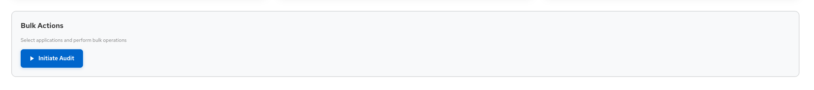

**Two-Step Audit Dialog Features:**
- **Step 1 - Initiate Audit**:
  - Multi-select application picker with search and filtering
  - Frequency selection (Quarterly/Yearly)
  - Period configuration (Quarter selection for quarterly audits)
  - Real-time validation and error handling
  - Automatic Jira ticket creation for each selected application
  - Progress tracking during audit initiation

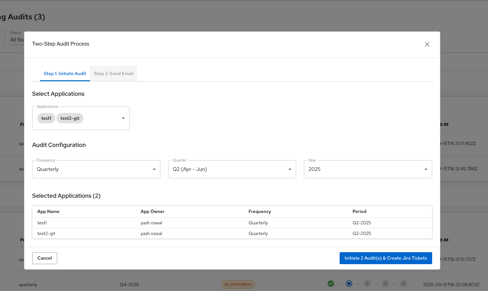

- **Step 2 - Send Email**:
  - Pre-populated recipient list (application owners)
  - Editable email content with HTML support
  - CC/BCC functionality
  - Email template with audit details and Jira links
  - Preview and edit modes for email content

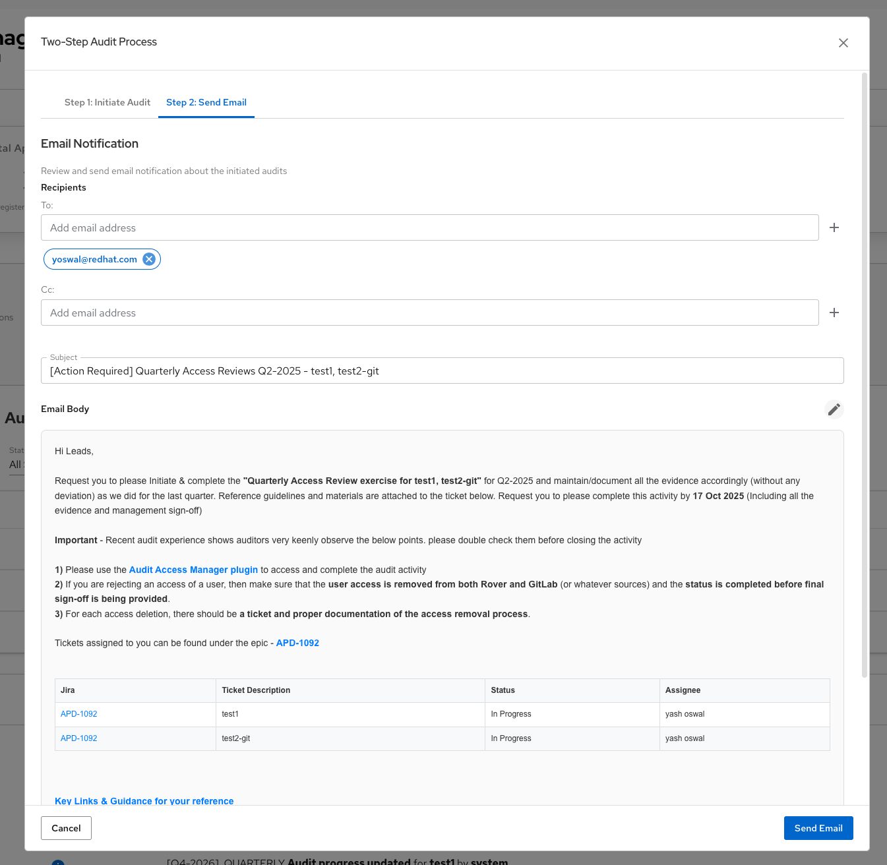

**Audit Initiation Email** (sent automatically after Step 2):
- **Automated Notifications**: System-generated emails for audit initiation
- **Rich Content**: HTML emails with audit details and action links
- **Due Date Tracking**: Clear deadlines and timeline information
- **Guidance Links**: Embedded links to documentation and guidelines
- **Action Buttons**: Direct links to audit system for immediate action

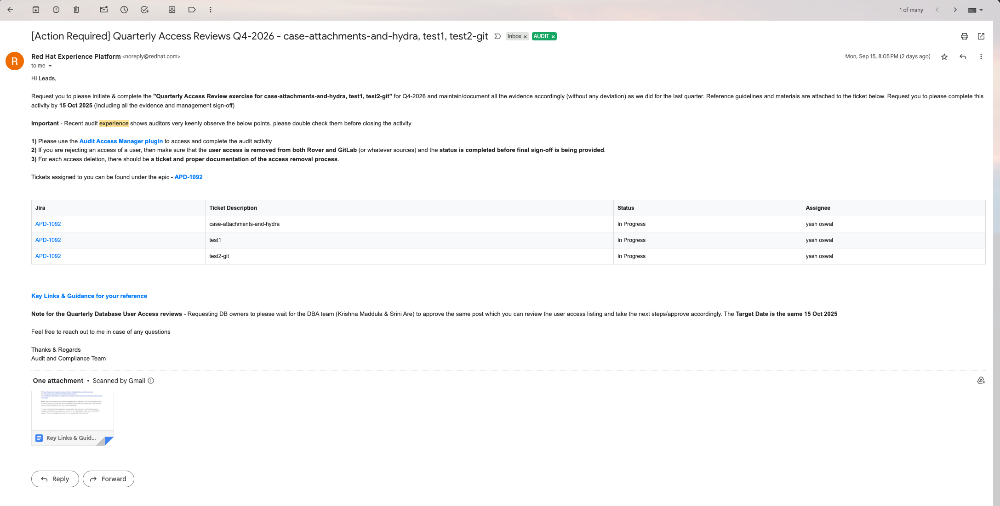

#### Ongoing Audits Section
- **Application Grouping**: Audits organized by application with expandable rows
- **Status Filtering**: Filter by audit status (All, Audit Started, In Progress, Access Review Complete, Completed, Not Started)
- **Search Functionality**: Real-time search across application names
- **Status Chips**: Color-coded status indicators with gradient system (blue for early stages, amber for progress, green for completion)
- **Progress Stepper**: Visual progress tracking showing current audit stage
- **Jira Integration**: Direct links to Jira tickets for each audit
- **View Details Action**: Quick navigation to detailed audit view

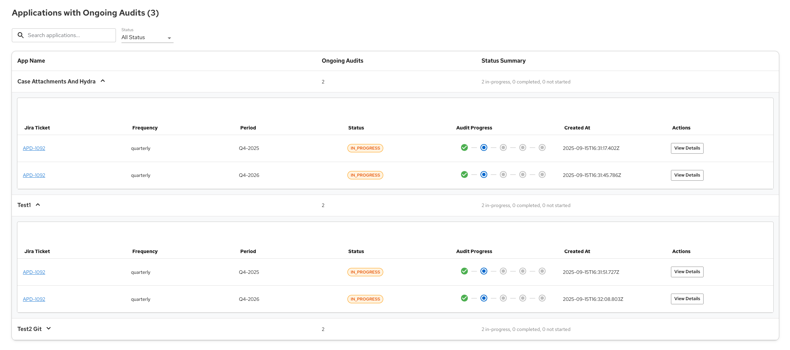

#### Global Activity Stream
- **Organization-wide Events**: Real-time feed of all audit activities across the organization
- **Event Types**: Audit initiation, progress updates, sign-offs, completions
- **User Attribution**: Shows who performed each action
- **Timestamp Tracking**: Chronological ordering of all audit events
- **Search and Filter**: Find specific events or activities

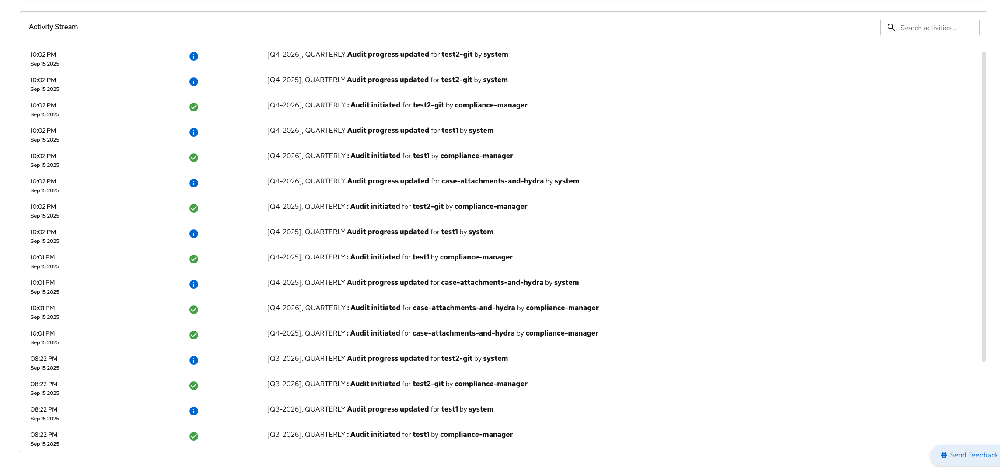

### Audit Access Manager

**URL:** `https://console.one.redhat.com/audit-access-manager`

The Audit Access Manager provides detailed application management and individual audit execution capabilities.

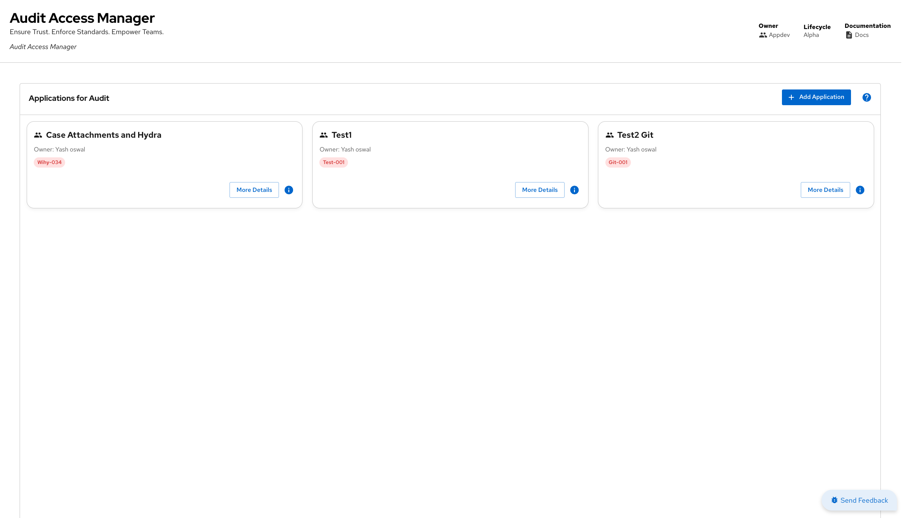

#### Application Management
- **Application Grid**: Card-based layout showing all registered applications
- **Application Cards**: Display application name, owner, CMDB codes, and quick actions
- **CMDB Integration**: Multiple CMDB codes displayed as chips
- **Quick Actions**: "More Details" button for navigation to detailed audit view
- **Application Details Side Panel**: View comprehensive application information without navigation

#### Application Onboarding
- **Add Application Modal**: Comprehensive form for registering new applications
- **Form Fields**:
  - Application name and CMDB ID
  - Environment selection
  - Application owner and delegate information
  - Jira project configuration
  - Account management (Rover, GitLab, LDAP)
  - Jira metadata fields (dynamic based on project)
- **Validation**: Real-time form validation and error handling
- **Account Management**: Support for multiple account types and sources

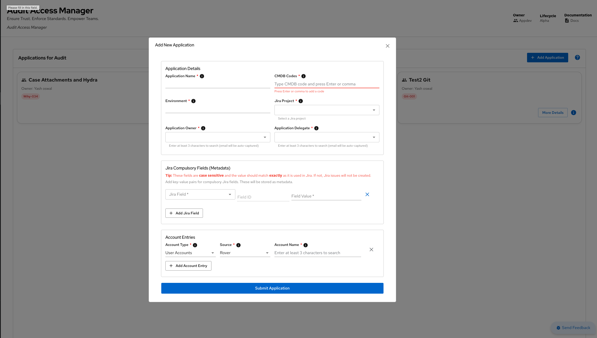

#### Application Details Side Panel
- **Comprehensive Information Display**: All application metadata in organized sections
- **Jira Metadata**: Dynamic display of Jira project fields with proper labeling
- **Account Details**: Separate sections for user accounts and service accounts by source
- **Edit Functionality**: In-place editing of application details
- **Delete Capability**: Application deletion with comprehensive warning and confirmation
- **Permission-based Actions**: Edit/delete buttons only visible to application owners

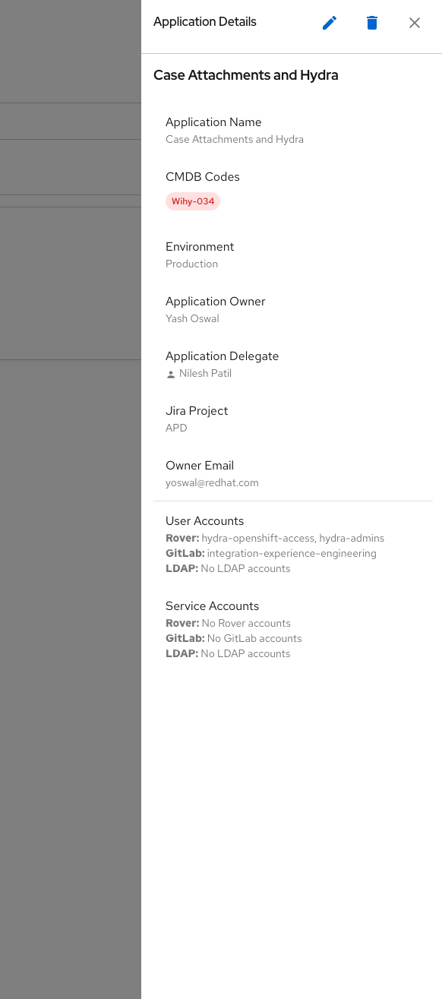

#### Audit Initiation
**URL:** `https://console.one.redhat.com/audit-access-manager/{app_name}`

- **Individual Application Audit**: Initiate audits for specific applications
- **Audit Configuration**: Set frequency and period for the audit
- **Navigation to Details**: Direct link to detailed audit execution

#### Audit Details Section
**URL:** `https://console.one.redhat.com/audit-access-manager/{app_name}/{frequency}/{period}/details`

The detailed audit view provides comprehensive audit execution capabilities with role-based access control.

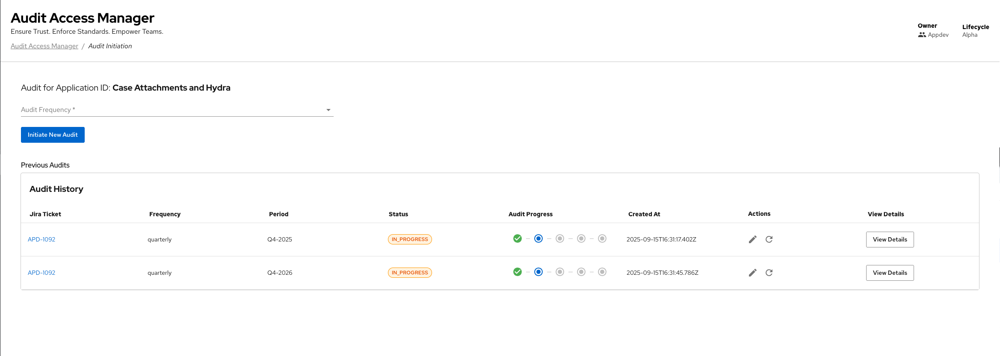

**Header Actions:**
- **Final Sign Off Button**: Available only to application owners, enables final audit completion
- **Email Reminder Button**: Available to application delegates, sends reminder to owners
- **View Final Summary Button**: Generates and displays audit summary (PDF generation)
- **Back Navigation**: Return to application list

**Email Reminder Modal** (triggered by Email Reminder Button):
- **Pre-populated Recipients**: Automatic recipient selection based on application owners
- **Template System**: Pre-built email templates with audit-specific content
- **Customization**: Editable email content with HTML support
- **Delivery Tracking**: Confirmation of email delivery
- **Reminder System**: Automated reminder functionality for pending actions

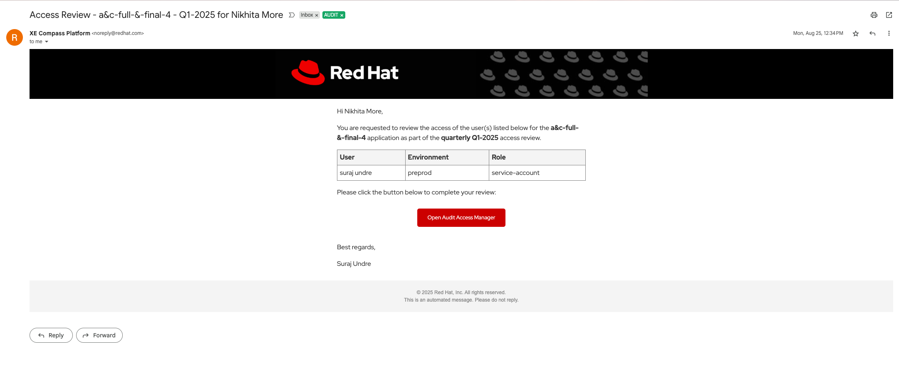

**Tabbed Interface:**
1. **User Access Reviews Tab**:
   - **Review Table**: Comprehensive list of all user access entries
   - **Bulk Actions**: Select multiple users for batch operations
   - **Individual Actions**: Approve, reject, or comment on each access
   - **Jira Integration**: Automatic ticket creation for rejected access
   - **Progress Tracking**: Real-time completion status
   - **Search and Filter**: Find specific users or access patterns

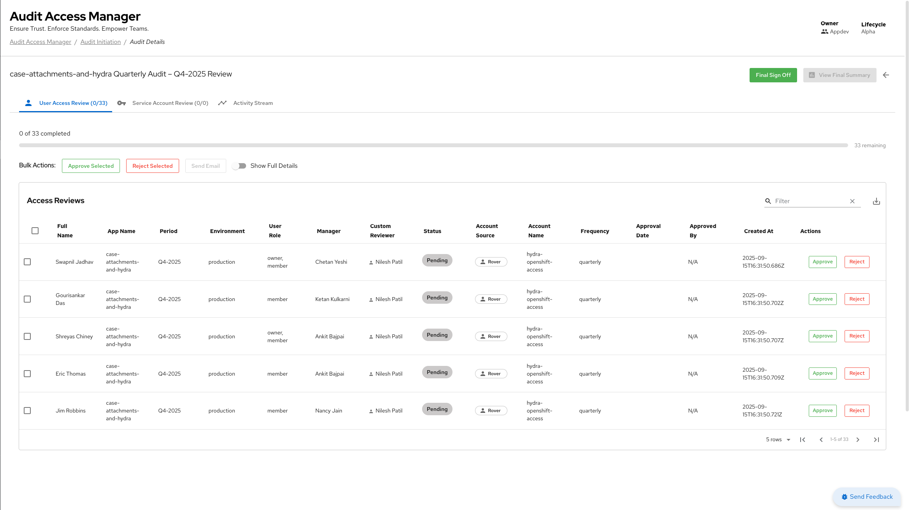

**Jira Integration Modal** (triggered when rejecting access):
- **Ticket Creation**: Automatic Jira ticket generation for rejected access
- **Ticket Management**: View and update Jira ticket status
- **Story Organization**: Group related tickets under audit stories
- **Status Synchronization**: Real-time status updates from Jira
- **Comment Integration**: Add comments and updates to Jira tickets

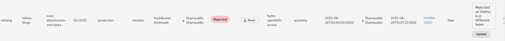

2. **Service Account Reviews Tab**:
   - **Service Account Table**: All service accounts requiring review
   - **Account Details**: Source information (Rover, GitLab, LDAP)
   - **Review Actions**: Approve, reject, or comment functionality
   - **Bulk Operations**: Multi-select for efficient processing
   - **Status Tracking**: Visual indicators for review completion

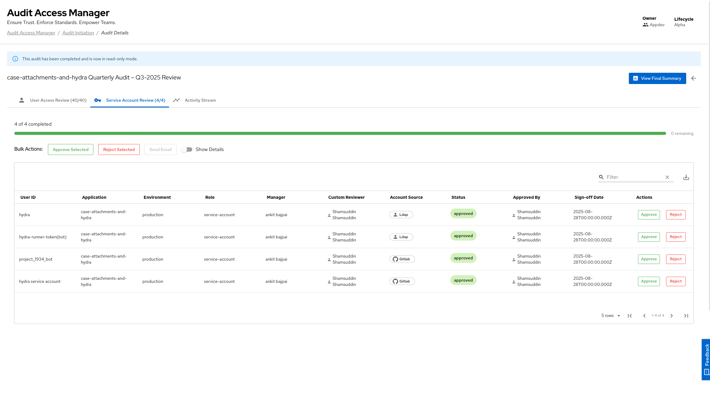

3. **Activity Stream Tab**:
   - **App-scoped History**: All activities related to the current audit
   - **Event Types**: User actions, system events, status changes
   - **Search Functionality**: Find specific events or activities
   - **Filtering Options**: Filter by event type, user, or date range
   - **Real-time Updates**: Live activity feed during audit execution

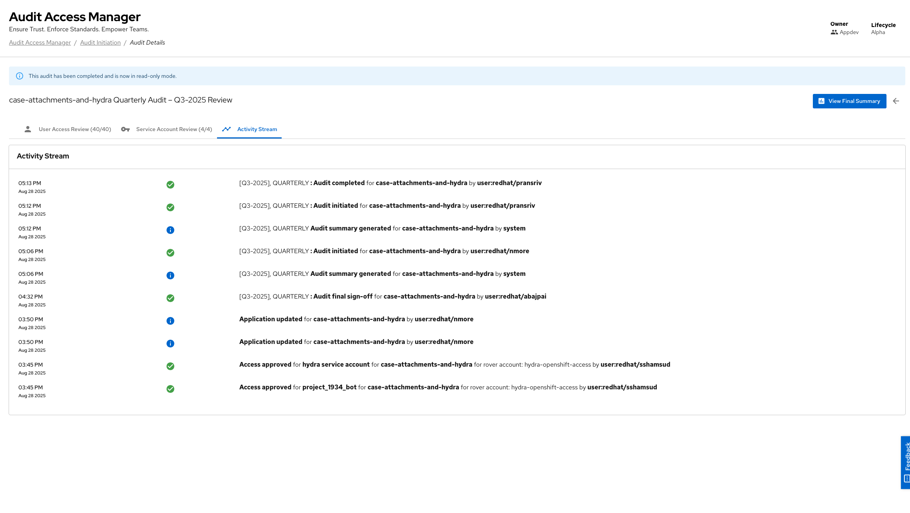

#### Progress Tracking
- **Audit Progress Stepper**: Visual representation of audit stages
- **Stage Definitions**:
  - **Audit Started**: Initial audit process initiation
  - **Details Under Review**: Audit details being reviewed by the team
  - **Final Sign-off Done**: Final sign-off completed for all reviews
  - **Summary Generated**: Audit summary generated and ready for review
  - **Completed**: Audit process completed successfully
- **Status Indicators**: Color-coded progress with tooltips
- **Real-time Updates**: Progress updates as audit moves through stages

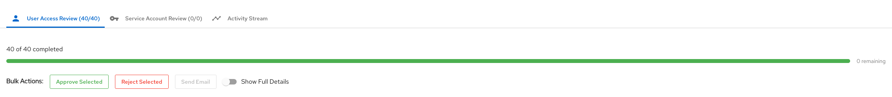

#### Audit Summary
**URL:** `https://console.one.redhat.com/audit-access-manager/{app_name}/{frequency}/{period}/summary`

- **PDF Generation**: Comprehensive audit summary in PDF format
- **Summary Components**:
  - Executive summary of audit results
  - Detailed review data tables
  - Approval/rejection statistics
  - Compliance metrics
  - Recommendations and findings
- **Download Capability**: Save and share audit summaries
- **Read-only Mode**: Summary available after audit completion

### Additional Screenshots

#### System Overview

## Notes

- Statuses surfaced in lists and chips include AUDIT_STARTED, IN_PROGRESS, ACCESS_REVIEW_COMPLETE, COMPLETED, and NOT_STARTED.
- The Compliance Manager "View Details" action opens the application's detailed view for deeper review and sign‑off.
