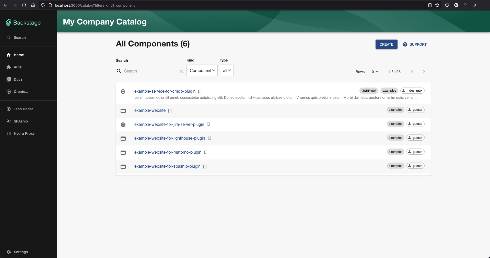

# Catalog Index Plugin

This plugin provides a React component that acts as a replacement for the default Backstage Catalog Index Page.



## Features

- Replaces the default backstage catalog index page
- Supports all the common backstage entity types (Component, API, System, Domain, User, Group, Resource, Location, etc.)
- Displays the entity type in the form of an icon for supported types (service, website, library, openapi, graphql, etc.)
- Displays the system and owners as Chips
- Displays the Application CMDB code for the annotated entities
- Provides a quick bookmark button to bookmark your favourite entities
- Provides pagination with url search parameter support

## Limitations

- No flexibility to customize the data that's shown in the list (coming in future version)
- Support for application statuses (coming in future version)

## Plugin Setup

1. Install the plugin:

```bash
# Yarn 1.x
yarn add --cwd packages/app @appdev-platform/backstage-plugin-catalog-index

# Yarn 2.x or 3.x
yarn workspace app add @appdev-platform/backstage-plugin-catalog-index
```

2. Add the `CatalogPage` component as a child to the CatalogIndexPage route

```tsx
import { CatalogPage } from '@appdev-platform/backstage-plugin-catalog-index';

const routes = (
  {/* other routes */}

  <Route path="/catalog" element={<CatalogIndexPage />}>
    <CatalogPage />
  </Route>

  {/* other routes */}
```
