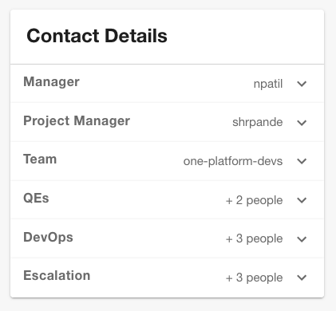
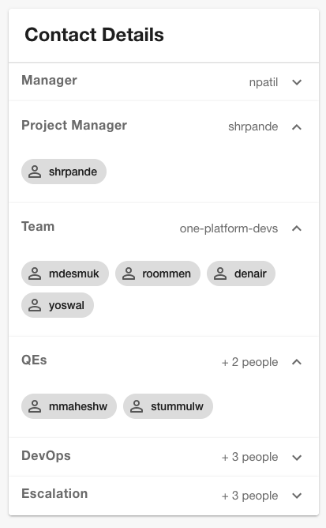

# Contact Details Plugin

Welcome to the contact-details plugin!

This plugin exposes a card component for the Contact Details of an entity. The contacts details can be provided in the entity's `catalog-info.yaml` in the form of a user list or a group.

<details>
<summary><strong>Screenshots</strong></summary>

| Card Collapsed | Card Expanded |
|---|---|
|  |  |
</details>


## Features

- Shows the details of an entity in a card view
- Flexible schema for creating and customizing sections/labels for contact details
- Integrates with Backstage User Catalog to display users and group members
- Supports almost all backstage entity kinds (Component, API, System, Domain, etc.)

## Limitations

- Only supports backstage user/group entity refs for contact details
- Only shows 5 group members for a group, with a "+ more" button to see more members (will be expanded in the future)

## Plugin Setup

1. Install this plugin:

```bash
# Yarn 1.x
yarn add --cwd packages/app @appdev-platform/backstage-plugin-contact-details

# Yarn 2.x or 3.x
yarn workspaces app add @appdev-platform/backstage-plugin-contact-details
```

2. Add the `ContactDetailsCard` to the overview tab of the Catalog Entity Page.

```tsx
// In packages/app/src/components/catalog/EntityPage.tsx
import {
  ContactDetailsCard,
  isContactDetailsAvailable,
} from '@appdev-platform/backstage-plugin-contact-details';


const overviewContent = (
  <Grid container spacing={3} alignItems="stretch">
    {/* other content */}

    <EntitySwitch>
      <EntitySwitch.Case if={isContactDetailsAvailable}>
        <Grid item md={4} xs={12}>
          <ContactDetailsCard />
        </Grid>
      </EntitySwitch.Case>
    </EntitySwitch>
```

4. Now, you can add the following to your entities to enable the contact details card:

```yaml
apiVersion: backstage.io/v1alpha1
kind: Component
metadata:
  # ...
spec:
  # ...
  contacts:
    - label: Team
      group: group:default/guests
    - label: <custom label>
      users:
        - user:default/user1
        - user:default/user2
```
