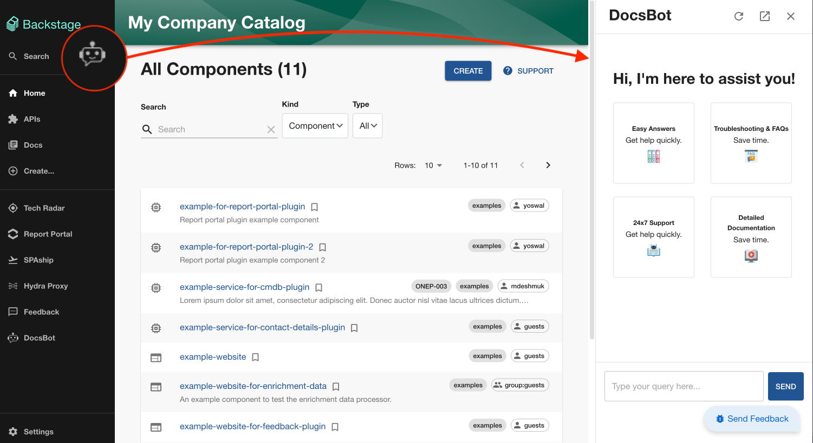
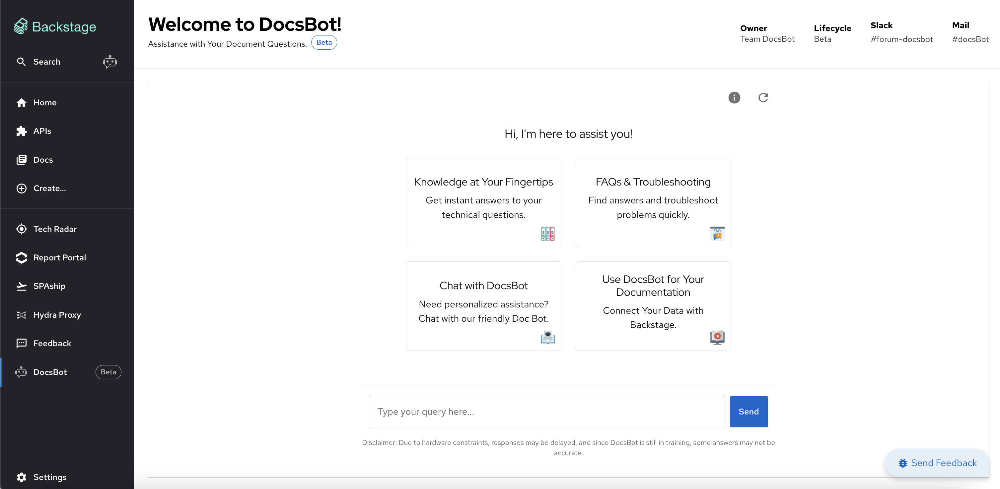
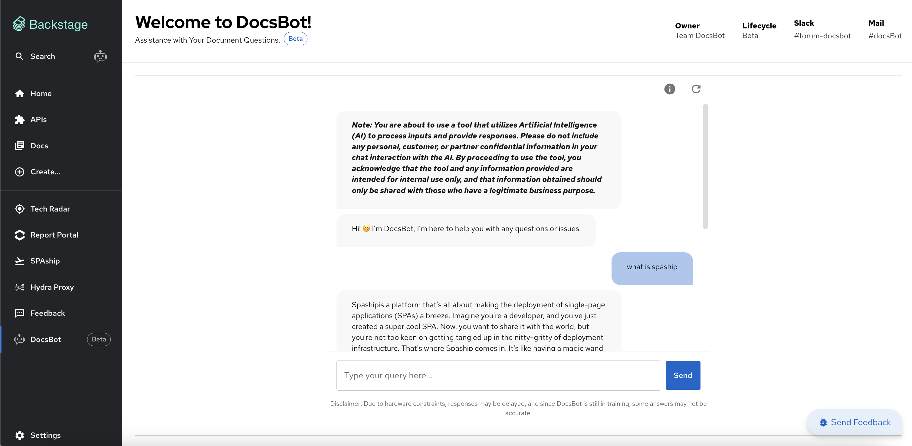

# DocsBot

Welcome to the documentation for **DocsBot**, a powerful chatbot integrated with Backstage that assists you with all your documentation needs. This documentation will guide you on how to use DocsBot effectively.

## Overview

DocsBot is designed to provide instant answers to your documentation-related queries. It is trained on a variety of document types, including PDFs, Confluence pages, GitLab files, and more. You can interact with DocsBot through a side panel component or a full sidebar entity within a Backstage page.

## Key Features

- **Instant Access:** Quickly access documentation through the side panel or full sidebar.
- **Comprehensive Training:** DocsBot is trained on various document types to provide accurate answers.
- **Ease of Use:** Simple and intuitive interface for querying documentation.

## Integration with Backstage

DocsBot is seamlessly integrated with Backstage, providing an embedded chat window for easy access. There are two primary ways to interact with DocsBot:

1. **Side Panel Component:** Access DocsBot via a collapsible side panel on any page within Backstage.

1. **Full Sidebar Entity:** Use DocsBot as a full sidebar entity for more extensive interactions and query history.

## How to Use DocsBot

Using DocsBot is straightforward. Follow these steps to get started:

### Accessing DocsBot

1. **Side Panel Component:**

   - Navigate to any page in Backstage.
   - Locate the DocsBot side panel on the right-hand side of the screen.
   - Click on the panel to expand and start asking your documentation questions.

2. **Full Sidebar Entity:**
   - Open the sidebar in Backstage.
   - Select the DocsBot entity.
   - Start querying the documentation within the expanded chat window.

### Asking Questions

- **Type Your Query:** Enter your documentation-related question in the chat window.
- **Receive Answers:** DocsBot will provide answers based on its training data, which includes PDFs, Confluence pages, GitLab files, and more.
- **Interact Further:** If needed, you can ask follow-up questions or request additional information.

### Examples

- **Querying a PDF:** "Can you explain the process outlined in the deployment guide PDF?"
- **Confluence Pages:** "What are the steps to set up a new project according to our Confluence documentation?"
- **GitLab Files:** "Show me the README file from our main repository on GitLab."

## Benefits

- **Efficiency:** Save time by getting instant answers to documentation queries without searching manually.
- **Accuracy:** Reliable responses trained on comprehensive documentation sources.
- **Convenience:** Easily accessible through Backstage, making it a seamless part of your workflow.

## Troubleshooting

If you encounter any issues while using DocsBot, consider the following steps:

- **Check Integration:** Ensure that DocsBot is properly integrated with your Backstage environment.
- **Review Permissions:** Verify that DocsBot has access to the necessary documentation sources.
- **Consult Documentation:** Refer to this documentation for guidance on using DocsBot effectively.

## Conclusion

DocsBot is an invaluable tool for efficiently accessing and querying your documentation. With its integration in Backstage, you can easily find the information you need without leaving your workflow. Start using DocsBot today to enhance your productivity and streamline your documentation queries.

---

For further assistance, please contact the support team or refer to the detailed user guide included in your Backstage documentation.
