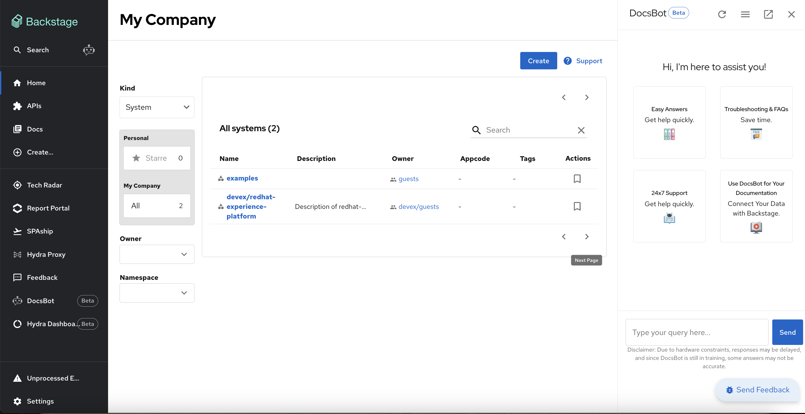
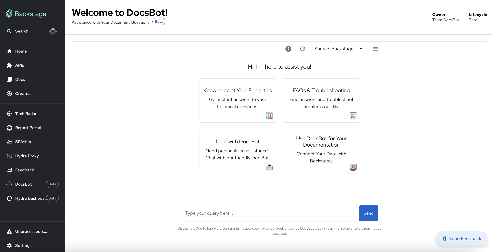

# DocsBot FAQs

Here are some frequently asked questions about using **DocsBot**, your integrated documentation chatbot in Backstage.

---

## **General Usage**

**1. What is DocsBot?**

DocsBot is an intelligent chatbot integrated into Backstage, designed to help you quickly access and query documentation from various sources like Backstage, Portfolio and Management, and SPAship.

**2. How do I access DocsBot?**

DocsBot is available in two components within [RHEP](https://console.one.redhat.com/docsbot):

1. **Collapsible Side Panel:** A convenient panel accessible from anywhere in Backstage.
   
2. **Dedicated Section (/docsbot):** A full-page view for more extensive interactions.
   

---

## **Collapsible Side Panel**

**3. How do I use the side panel?**

- Click the DocsBot icon to open the side panel.
- Type your query in the input box and press **Enter** to submit.
- View responses and provide feedback directly in the panel.

**4. Can I use the side panel anywhere in Backstage?**

Yes, the collapsible side panel is accessible from any page within Backstage.

**5. What feedback options are available in the side panel?**

You can:

- Click the **thumbs up** or **thumbs down** icon for feedback.
- Add additional comments in the feedback text box and click **Submit**.

---

## **Dedicated Section (/docsbot)**

**6. What features are available in the /docsbot section?**

The /docsbot section includes:

- A dedicated chat interface for asking queries.
- Options to reload the conversation.
- The ability to change document sources.
- Cached response management.

**7. What are cached responses, and how do they work?**

- **Enabled:** Cached responses provide faster answers by using pre-stored responses for similar queries.
- **Disabled:** Disabling caching ensures a fresh response is generated for your query.

---

## **Document Sources**

**8. What document sources does DocsBot support?**

Currently, DocsBot supports the following sources:

- Backstage documentation
- Portfolio and Management documentation
- SPAship documentation

**9. How do I switch document sources?**

- In the DocsBot interface, click on the **Source** menu.
- Select your desired source from the dropdown options.

---

## **Troubleshooting**

**10. What should I do if DocsBot doesn’t respond?**

- Ensure your internet connection is stable.
- Reload the chat interface using the **Reload Chat** option.
- Verify that DocsBot is properly integrated with Backstage.

**11. Why are my responses taking time?**

DocsBot might take longer to respond if:

- Caching is disabled.
- The system is under heavy usage due to limited infrastructure.

**12. How do I provide feedback for DocsBot responses?**

You can submit feedback directly in the interface by:

- Clicking on the **thumbs up** or **thumbs down** icon for each response.
- Adding additional comments and clicking **Submit**.

---

## **Feedback and Support**

**13. How can I share my feedback on DocsBot?**

You can provide feedback for individual responses using the feedback options or contact your support team for additional suggestions.

**14. Who should I contact if I encounter an issue with DocsBot?**

Reach out to the Backstage support team or refer to the detailed DocsBot documentation for assistance.

---

## **Best Practices**

**15. Should I enable or disable cached responses?**

- Enable caching for faster responses if you expect to ask similar queries repeatedly.
- Disable caching for updated or new responses.

**16. How can I make the most of DocsBot?**

- Use specific queries to get precise answers.
- Choose the appropriate document source for your query.
- Provide detailed feedback to improve response accuracy.

---

## **Additional FAQs**

**17. Who are the developers of DocsBot?**

DocsBot was developed by:

- Arkaprovo Bhattacharjee
- Nikhita More

**18. Where can I find the DocsBot roadmap?**

You can find the DocsBot roadmap on the Miro Board: [Miro Board Link](https://miro.com/app/board/uXjVKI5DbyE=/?share_link_id=908304069121)

**19. Is there a Jira project to follow up and create issues?**

Yes, you can follow and create issues in the Jira project: [Jira Link](https://issues.redhat.com/browse/APD)

**20. Can I source my service or team documents?**

We are developing a functionality that would allow users to source their own documents to DocsBot.

**21. What should I do if DocsBot is stuck in a loading loop?**

DocsBot might be stuck in a loading loop if it is running on limited hardware. Your query might be queued. Please wait a minute or contact the support team for assistance.

**22. What should I do if DocsBot is not responding?**

If DocsBot is not responding, try the following:

- Refresh the page.
- Check your internet connection.
- Contact the support team if the issue persists.

**23. How do I use DocsBot?**

DocsBot is available in Backstage, but you’ll need to enable it first. To do this, go to **Settings** and enable the DocsBot plugin.

**24. Where is DocsBot available in Backstage?**

DocsBot is available in two places within Backstage:

1. **Collapsible Side Panel**: Click the DocsBot icon to open it.
2. **Dedicated Component Page**: Go to the `/docsbot` page for a full-page experience.

**25. How do I troubleshoot issues with DocsBot?**

To troubleshoot issues, try the following:

- Check your internet connection.
- Ensure the documents are properly formatted.
- Contact support if the issue persists.

**26. What types of documents can DocsBot access?**

DocsBot can access a variety of documents, including:

- Slack conversations
- Source code
- Markdown files
- In the future, DocsBot will also support TechDocs and Backstage data.

**27. How can I provide feedback on the chatbot?**

You can provide feedback by:

- Clicking on the **Send Feedback** button.
- Using the thumbs up or thumbs down buttons on individual responses.

**28. Can I report a bug or issue with DocsBot?**

Yes, you can report bugs or issues by filling out the bug report form available in the **Send Feedback** section.

**29. Is there a community or forum for discussing DocsBot?**

Yes, you can join our Slack channel at **devEx** and **AI** to discuss DocsBot with other users and share tips and tricks.

**30. Why is DocsBot not accurately retrieving information from my documents?**

If DocsBot is not accurately retrieving information, it could be due to:

- Unsupported document format (e.g., PDF or Word).
- Document formatting issues.
- Outdated data in the document.
- Insufficient context in the query. Try rephrasing your question to be more specific.

---

**31. What data sources can DocsBot pull data from?**

DocsBot has data connectors to pull data from:

- Confluence
- Slack
- Backstage
- TechDocs
