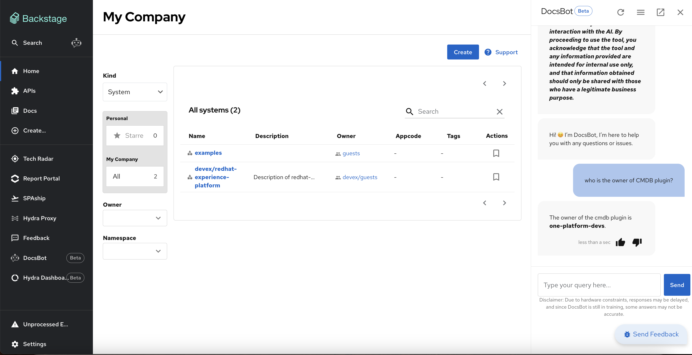
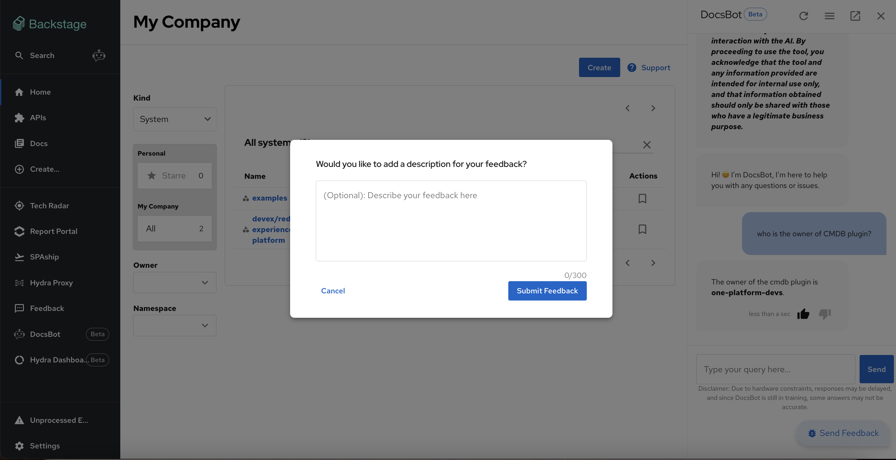
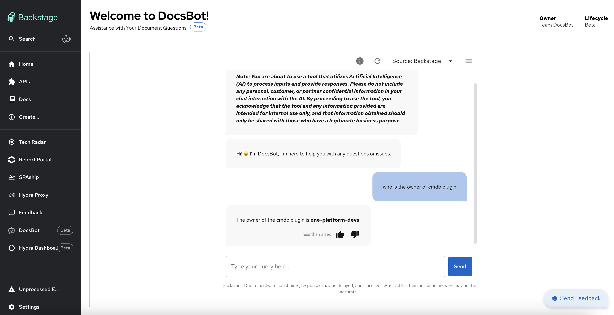
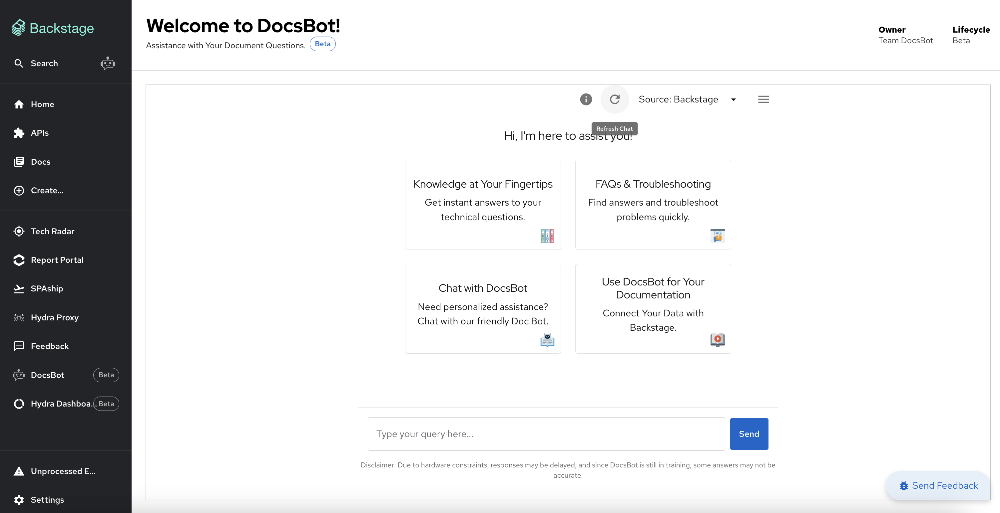
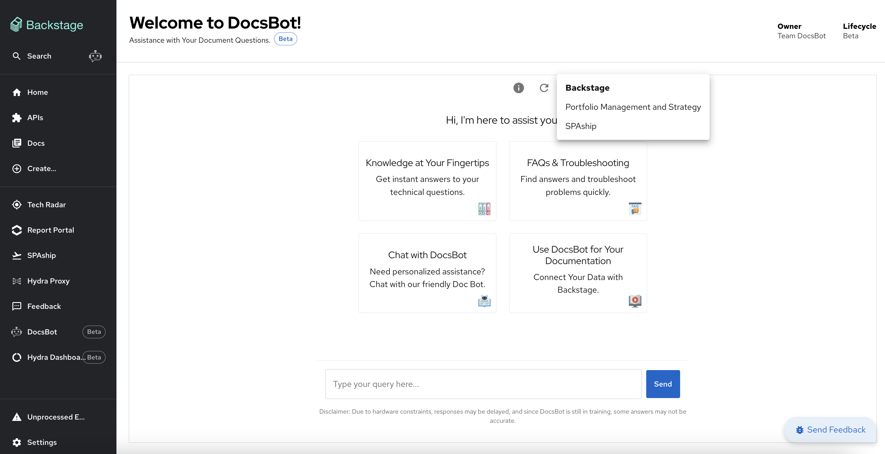
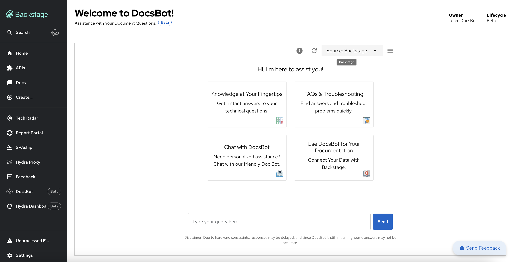
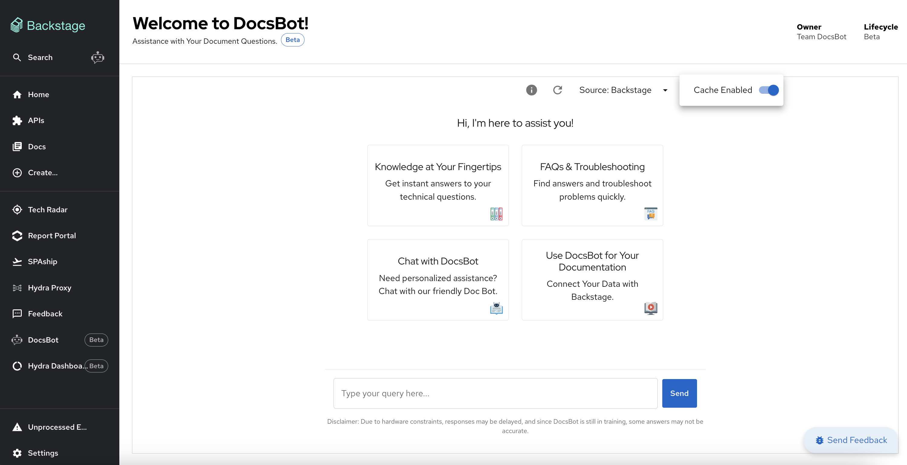
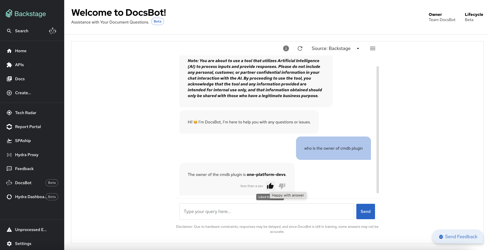
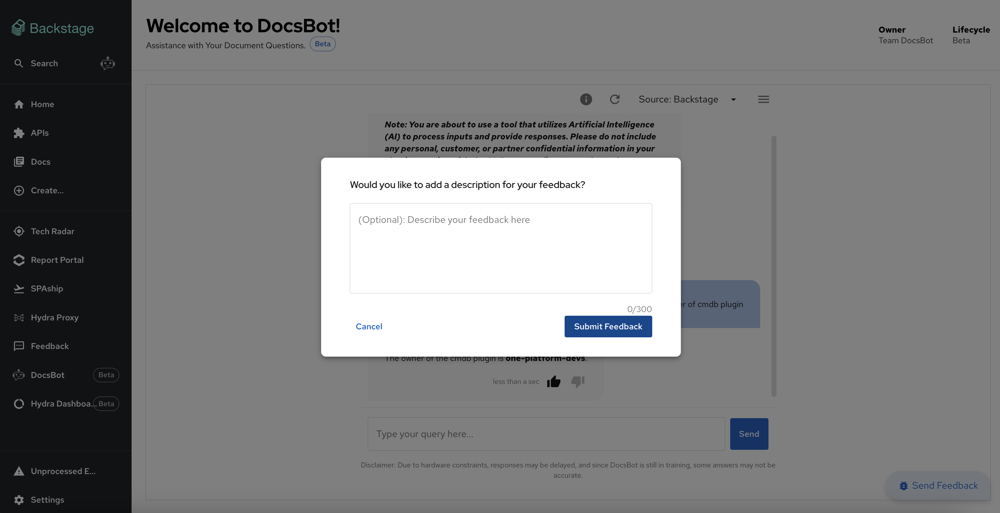

# DocsBot Usage Guide

Welcome to the DocsBot usage guide! DocsBot is your intelligent documentation chatbot integrated into Backstage, providing you with quick access to answers and insights from your documentation. Follow this guide to learn how to effectively use DocsBot.

---

## Components in Backstage

DocsBot is accessible via two components in Backstage:

1. **Collapsible Side Panel:** A convenient panel accessible from anywhere in Backstage.
   
2. **Dedicated Section (/docsbot):** A full-page view for more extensive interactions.
   

---

## How to Use DocsBot

### **1. Collapsible Side Panel**

- **Accessing the Panel:**
  - Locate the DocsBot icon near the search bar in Backstage.
  - Click the icon to expand the panel.

- **Using the Panel:**
  - Type your query in the input box.
  - Press **Enter** to submit your question.
  - DocsBot will provide a response below.

- You can:

  - Reload the conversation.
  - Expand the chat to the main component.
  - Close the section below the response.

- **Feedback Options:**
  - Provide feedback for each response by clicking the **thumbs up** or **thumbs down** icon.
  - Add additional comments for feedback in the text box and click **Submit**.

- **Special Features:**
  - Submit queries, view a banner, and manage response settings.
  - Change the source of documents. Supported sources include:
    - Backstage
    - Portfolio and Management
    - SPAship
  - Enable or disable cached responses:
    - **Enabled:** Faster responses from previously stored answers.
    - **Disabled:** Fresh responses for every query.

---

### **2. Dedicated Section (/docsbot)**

- **Accessing the Section:**
  - Navigate to `/docsbot` in Backstage for a full-page DocsBot experience.

- **Using the Section:**
  - Type your question in the input box.
  - Press **Enter** to submit.
  - Responses may take longer due to limited infrastructure.

- **Additional Options:**
  - Reload the conversation.

- Change document sources.

- Enable or disable cached responses for optimized results.

- **Feedback Options:**
  - Provide feedback for each response.

- Add additional comments in the feedback text box and click **Submit**.

---

## Best Practices

- **Cached Responses:** Enable caching for faster responses if you are likely to repeat queries. Disable caching for fresh responses.
- **Feedback:** Help improve DocsBot by submitting detailed feedback for responses.
- **Source Selection:** Choose the relevant document source for the most accurate results.
