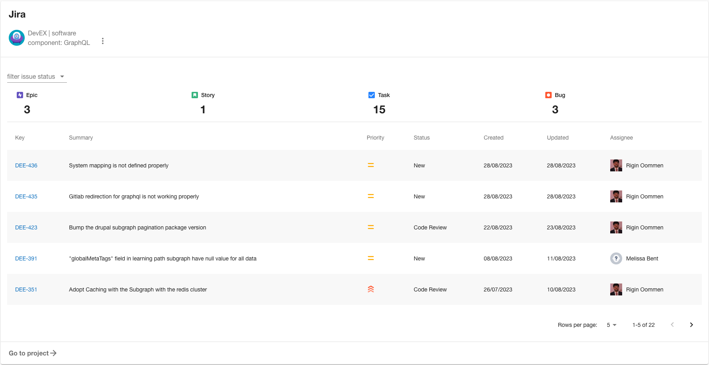

# Jira Server

## Introduction

Welcome to the Jira Server plugin!

This plugin exposes a card component with information about the project. It relies on Jira for the Project Details.



This plugin is designed to work with all Entity kinds which contain the annotation: `jira/project-key`.

## Getting started

To get started, you need a running Jira instance.

1. Add this plugin to Backstage, first install the plugin:

```bash
# From your Backstage root directory
yarn add --cwd packages/app @appdev-platform/backstage-plugin-jira-server
```

2. Update the `app-config.yaml` and add ServiceNow host under the `proxy` section, and a separate `jira` field:

```yaml
proxy:
  # ...
  '/jira/api':
    target: '<JIRA_URL>'
    headers:
      Authorization:
        $env: JIRA_TOKEN
      Accept: 'application/json'
      Content-Type: 'application/json'
      X-Atlassian-Token: 'nocheck'
      User-Agent: 'MY-UA-STRING'

jira:
  # Defaults to /jira/api and can be omitted if proxy is configured for that url
  proxyPath: /jira/api
```

3. Set img-src in Content Security Policy

```yaml
// app-config.yaml
backend:
  # ...
  csp:
    img-src:
      # "'self'" and 'data' are from the backstage default but must be set since img-src is overriden
      - "'self'"
      - 'data:'
      # Allow your Jira instance for @appdev-platform/backstage-plugin-jira-server
      - 'JIRA_URL'

```

3. Add the `EntityJiraOverviewCard` to the overview tab of the Catalog Entity Page.

```tsx
// In packages/app/src/components/catalog/EntityPage.tsx
import {
  EntityJiraOverviewCard,
  isJiraAvailable,
} from '@appdev-platform/backstage-plugin-jira-server';

const overviewContent = (
  <Grid container spacing={3} alignItems="stretch">
    {/* other content */}
    <EntitySwitch>
      <EntitySwitch.Case if={isJiraAvailable}>
        <Grid item md={6}>
          <EntityJiraOverviewCard />
        </Grid>
      </EntitySwitch.Case>
    </EntitySwitch>
  </Grid>
);
```

4. Now, to link an entity to it's Jira Project, the entity must be annotated as follows:

```yaml
apiVersion: backstage.io/v1alpha1
kind: Component
metadata:
  # ...
  annotations:
    jira/project-key: <example-jira-project-key>
    jira/component: <example-component> # optional, you might skip value to fetch data for all components
    jira/label: <example-label> # optional, you might skip value to fetch data for all labels
```
