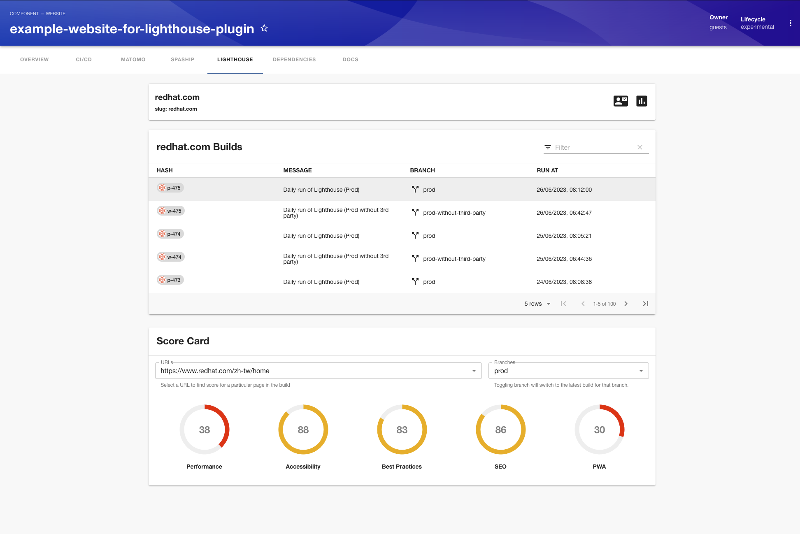

# Lighthouse Plugin

The Lighthouse plugin shows your lighthouse build scores. It also helps to inspect various Urls in your build.



## Getting started

1. Install the plugin

```bash
yarn add @compass/backstage-plugin-lighthouse
```

2. Add the Lighthouse proxy

```yaml
proxy:
  '/lighthouse':
    target: ${LIGHTHOUSE_INSTANCE_URL}
    changeOrigin: true
    allowedMethods: ['GET']
```

3. Add the Lighthouse meta details like contact etc

```yaml
lighthouse:
  instance_url: ${LIGHTHOUSE_INSTANCE_URL}
  contact_us: ${LIGHTHOUSE_CONTACT_URL}
```

### Entity Pages

1. Add the plugin as a tab to website entity pages

```ts
// In packages/app/src/components/catalog/EntityPage.tsx
import { LighthousePage } from '@compass/backstage-plugin-lighthouse';

const websiteEntityPage = (
  <EntityLayout>
    <EntityLayout.Route path="/lighthouse" title="Lighthouse">
      <LighthousePage />
    </EntityLayout.Route>
  </EntityLayout>
);
```

2. Add annotation to `catalog-info-yaml`

```yaml
metadata:
  name: lighthouse-website
  annotations:
    lighthouse.io/project-name: 'your lighthouse project name'
```
