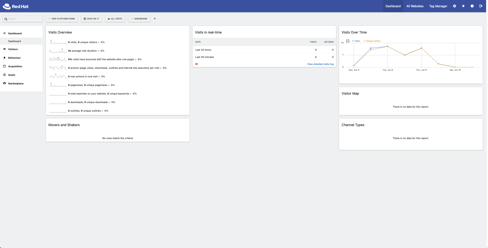

# User Guide

This guide will help users integrate the Matomo plugin with their web applications.

## Obtain Your Matomo Configurations

If your application is not currently using Matomo for user behavoir analytics, you will need to register your application with matomo in order to use the plugin.

We require the Matomo Site ID of your application

1. Login to [Matomo Portal](https://matomo.one.redhat.com)

2. Select your website, and inside the URL the idSite parameter shows you the matomo Site ID.
   

## Configure Your Catalog-Info.yaml File

Now that you have the matomo site id, add an annotation to your catalog-info-yaml.

```yaml
metadata:
  name: <your-application-id>
  annotations:
    matomo.io/site-id: '<YOUR_MATOMO_SITE_ID'
```

That's it, head over to the matomo tab and now you will be able to get insights from matomo for your application
