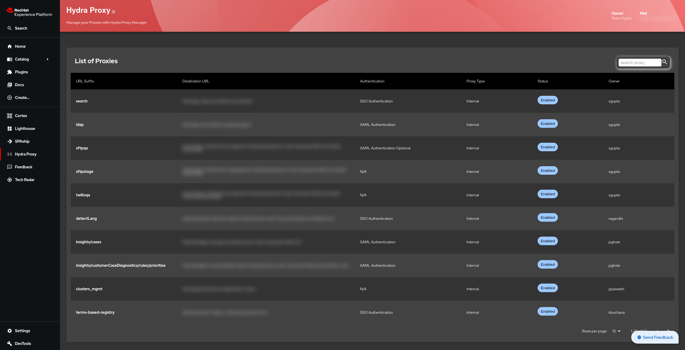

# Hydra Proxy Manager

### Introduction

Welcome to the Hydra Proxy Manager plugin!

This plugin helps you to view and manage application endpoints with Hydra Proxy Manager.

### Screenshot



### Getting started

To get started, you need to install the plugin and configure the as follows:

1. Install the plugin

   ```bash
   # From your backstage root directory
   yarn add --cwd packages/app @appdev/backstage-plugin-proxy-manager
   ```

2. Update the app-config.yaml and add proxyManager config

   ```yaml
   proxyManager:
     apiBaseUrl: ${PROXY_MANAGER_API_BASE_URL}
   ```

   If your backstage installation does not have OAuth2 enabled already, you may need to add the oauth2 auth provider in the app-config.yaml

   ```yaml
   auth:
     # see https://backstage.io/docs/auth/ to learn about auth providers
     environment: development
     providers:
       oauth2:
         development:
           authorizationUrl: ${AUTH_SSO_AUTHORIZATION_URL}
           tokenUrl: ${AUTH_SSO_TOKEN_URL}
           clientId: ${AUTH_SSO_CLIENT_ID}
           clientSecret: ${AUTH_SSO_CLIENT_SECRET}
   ```

3. Now you can add the `ProxyManagerPage`:

   ```tsx
   // In packages/app/src/App.tsx
   import { ProxyManagerPage } from '@appdev/backstage-plugin-proxy-manager';

   const routes = (
     <FlatRoutes>
       // ...
       <Route path="/proxy-manager" element={<ProxyManagerPage />} />
       // ...
     </FlatRoutes>
   );
   ```

4. You can also add the Proxy Manager to the sidebar navigation:

   ```tsx
   // In packages/app/src/components/Root/Root.tsx
   import { HydraProxyIcon } from '@appdev/backstage-plugin-proxy-manager';

   export const Root = ({ children }: PropsWithChildren<{}>) => (
     <SidebarPage>
       // ...
       <SidebarGroup label="Menu" icon={<MenuIcon />}>
         // ...
         <SidebarScrollWrapper>
           <SidebarItem
             icon={HydraProxyIcon}
             to="proxy-manager"
             text="Hydra Proxy"
           />
         </SidebarScrollWrapper>
       </SidebarGroup>
     </SidebarPage>
   );
   ```

### Maintainers

Hydra Team:

- Gourisankar Das (@goudas): goudas@redhat.com
