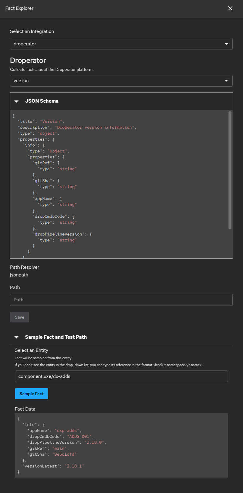

# Droperator fact collector

This module is an extension for the [Soundcheck][soundcheck] plugin.

It provides a [fact collector][soundcheck-fact-collector] that collects
information from [Droperator][droperator] deployments.

## Prerequisites

The [Backstage GitLab integration][backstage-gitlab-integration] must be
configured before this module will work:

```yaml
# app-config.yaml

integrations:
  gitlab:
    - host: gitlab.cee.redhat.com
      token: ${GITLAB_CEE_TOKEN}
      apiBaseUrl: https://gitlab.cee.redhat.com/api/v4
```

## Installation

In the root directory of your Backstage project, run:

```shell
yarn workspace backend add @appdev-platform/backstage-plugin-soundcheck-backend-module-droperator
```

Add the module to the backend:

```typescript
// packages/backend/src/index.ts

const backend = createBackend();

// ...

backend.add(import('@appdev-platform/backstage-plugin-soundcheck-backend-module-droperator'));
```

## Examples

### Fact explorer



[backstage-gitlab-integration]: https://backstage.io/docs/integrations/gitlab/locations/

[droperator]: https://dxp.pages.redhat.com/dat/droperator-platform/droperator-pipeline/

[soundcheck]: https://backstage.spotify.com/marketplace/spotify/plugin/soundcheck/

[soundcheck-fact-collector]: https://backstage.spotify.com/docs/plugins/soundcheck/core-concepts/fact-collectors/
