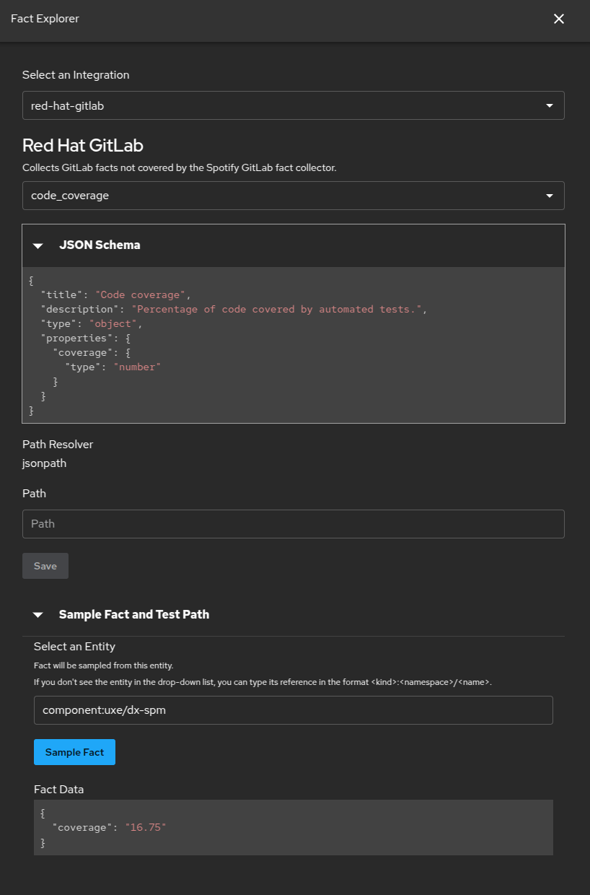

# Red Hat GitLab fact collector

This module is an extension for the [Soundcheck][soundcheck] plugin.

It provides a [fact collector][soundcheck-fact-collector] that collects
information from GitLab that is not provided by
the [GitLab fact collector built-in to Soundcheck][soundcheck-gitlab-fact-collector]:

* Code coverage (from the [GitLab Pipelines API][gitlab-pipelines-api])
* [Composer][php-composer] lock file modification time
* [Drupal extension info file][drupal-extension-info-file]
* [Environments][gitlab-environments]
* Latest [commit][gitlab-commits]
* Latest [pipeline][gitlab-pipelines]
* [Merge request approval rules][gitlab-merge-request-approval-rules]
* [Repository tree][gitlab-repository-tree]
* [Shared stages][red-hat-gitlab-shared] usage

## Prerequisites

The [Backstage GitLab integration][backstage-gitlab-integration] must be
configured before this module will work:

```yaml
# app-config.yaml

integrations:
  gitlab:
    - host: gitlab.cee.redhat.com
      token: ${GITLAB_CEE_TOKEN}
      apiBaseUrl: https://gitlab.cee.redhat.com/api/v4
```

## Installation

In the root directory of your Backstage project, run:

```shell
yarn workspace backend add @compass/backstage-plugin-soundcheck-backend-module-red-hat-gitlab
```

Add the module to the backend:

```typescript
// packages/backend/src/index.ts

const backend = createBackend();

// ...

backend.add(import('@compass/backstage-plugin-soundcheck-backend-module-red-hat-gitlab'));
```

## Examples

### Fact explorer



[backstage-gitlab-integration]: https://backstage.io/docs/integrations/gitlab/locations/

[drupal-extension-info-file]: https://www.drupal.org/docs/develop/creating-modules/let-drupal-know-about-your-module-with-an-infoyml-file

[gitlab-commits]: https://docs.gitlab.com/api/commits/#get-a-single-commit

[gitlab-environments]: https://docs.gitlab.com/ee/ci/environments/

[gitlab-merge-request-approval-rules]: https://docs.gitlab.com/user/project/merge_requests/approvals/rules/

[gitlab-pipelines]: https://docs.gitlab.com/ee/ci/pipelines/index.html

[gitlab-pipelines-api]: https://docs.gitlab.com/ee/api/pipelines.html

[gitlab-repository-tree]: https://archives.docs.gitlab.com/16.11/ee/api/repositories.html#list-repository-tree

[php-composer]: https://getcomposer.org/

[red-hat-gitlab-shared]: https://gitlab.cee.redhat.com/dxp/dat/gitlab-shared

[soundcheck]: https://backstage.spotify.com/marketplace/spotify/plugin/soundcheck/

[soundcheck-fact-collector]: https://backstage.spotify.com/docs/plugins/soundcheck/core-concepts/fact-collectors/

[soundcheck-gitlab-fact-collector]: https://backstage.spotify.com/docs/plugins/soundcheck/core-concepts/fact-collectors/3p-integrations/gitlab
