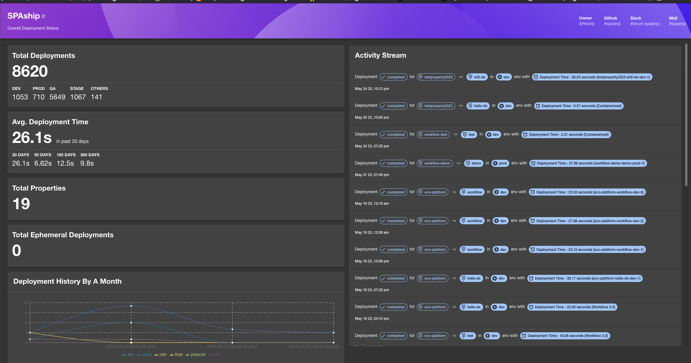

# SPAship Plugin

The SPAship plugin shows the various [SPAship](https://spaship.redhat.com) deployment status and analytics




## Getting started

1. Install the plugin

```bash
yarn add @appdev/backstage-plugin-spaship
```

2. Add the SPAship proxy

```yaml
proxy:
  '/spaship':
    target: ${SPASHIP_API_URL}
    changeOrigin: true
    allowedMethods: ['GET']
    headers:
      Authorization: Bearer ${SPASHIP_API_TOKEN}
```

3. Add the SPAship meta details like contact etc

```yaml
spaship:
  managerHost: ${SPASHIP_MANAGER_URL}
  slackUrl: ${SPASHIP_SLACK_URL}
  contactMail: ${SPASHIP_MAIL}
  githubUrl: ${SPASHIP_GITHUB_URL}
  owner: ${SPASHIP_OWNER_REF}   # for example: 'user:default/guest'
```

### Entity Pages

1. Add the plugin as a tab to website entity pages

```ts
// In packages/app/src/components/catalog/EntityPage.tsx
import { SpashipPage } from '@appdev/backstage-plugin-spaship';

const websiteEntityPage = (
  <EntityLayout>
    <EntityLayout.Route path="/spaship" title="SPAship">
      <SpashipPage />
    </EntityLayout.Route>
  </EntityLayout>
);
```

2. Add the global spaship page for view global deployment status

```ts
// In packages/app/src/App.tsx
import { SpashipGlobalPage } from '@appdev/backstage-plugin-spaship';

const routes = (
  <FlatRoutes>
    // ...
    <Route path="/spaship" element={<SpashipGlobalPage />} />
    // ...
  </FlatRoutes>
);
```

3. Add the global SPAship section to the sidebar for navigation

```ts
// In packages/app/src/components/Root/Root.tsx
import SpashipIcon from '@material-ui/icons/FlightTakeoff';

export const Root = ({ children }: PropsWithChildren<{}>) => (
  <SidebarPage>
    <Sidebar>
      // ...
      <SidebarScrollWrapper>
        <SidebarItem icon={SpashipIcon} to="spaship" text="SPAship" />
      </SidebarScrollWrapper>
      // ...
    </Sidebar>
    {children}
  </SidebarPage>
);
```

3. Add annotation to `catalog-info-yaml`

```yaml
metadata:
  name: spaship-website
  annotations:
    spaship.io/property-id: '<spaship-property-id>'
    spaship.io/app-id: '<spaship-app-id>'
```
