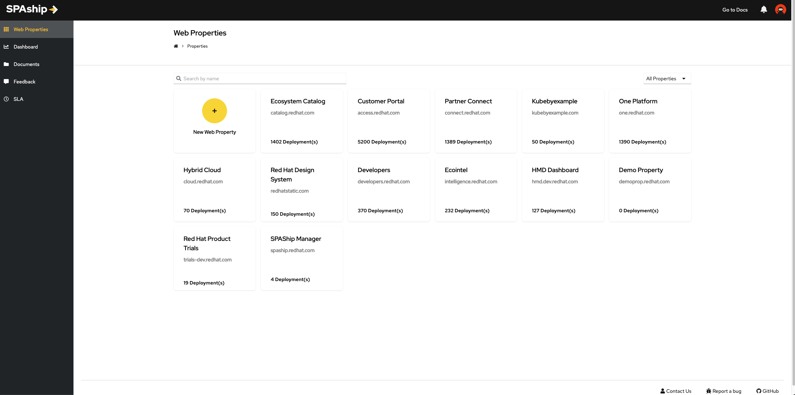
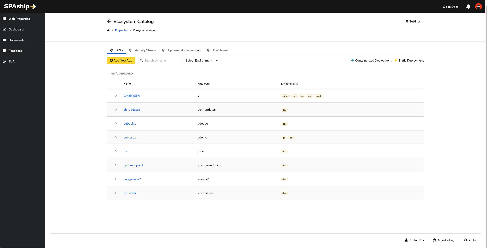

# User Guide

This guide will help users integrate the SPAship plugin with their web applications.

## Obtain Your SPAship Configurations

If your application is not currently using SPAship for deployment, you will need to register your application with SPAship in order to use the plugin. Please refer to the [SPAship onboarding document](https://spaship.io/docs/guide/user-guide/Quickstart/) to get started.

We require the web property and application ID from SPAship in order to configure your particular SPA.

1. The home page contains all SPAship web properties.
   

2. Select the property on which your application is hosted, and then obtain the application ID from there.
   

3. Your `spaship.yaml` also contains the both the details regarding web property id and application id.

## Configure Your Catalog-Info.yaml File

Now that you have the web property ID and application ID from SPAship, add an annotation to your catalog-info-yaml.

```yaml
metadata:
  name: <spa-name>
  annotations:
    spaship.io/property-id: '<spaship-property-id>'
    spaship.io/app-id: '<spaship-app-id>'
```

That's it, head over to the SPAship tab and now you will be able to get insights from SPAship for your application
