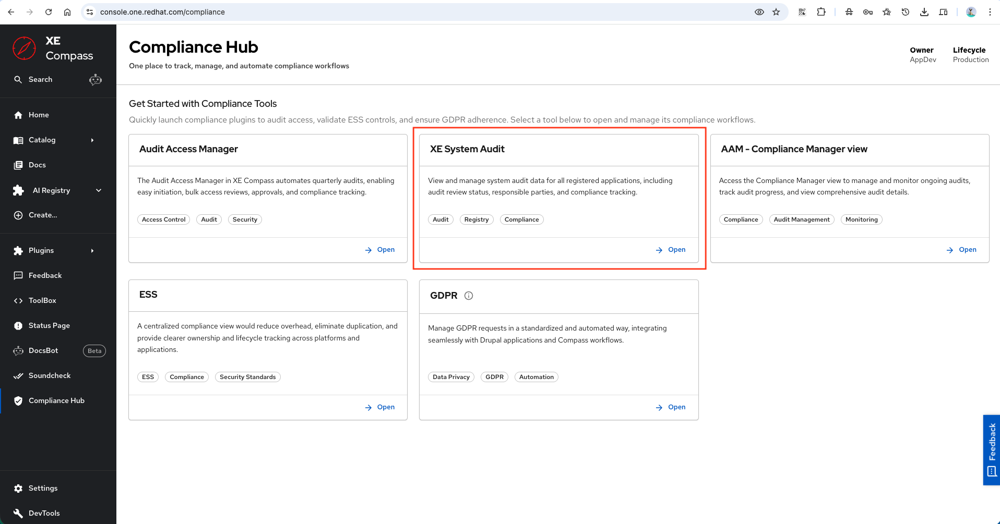
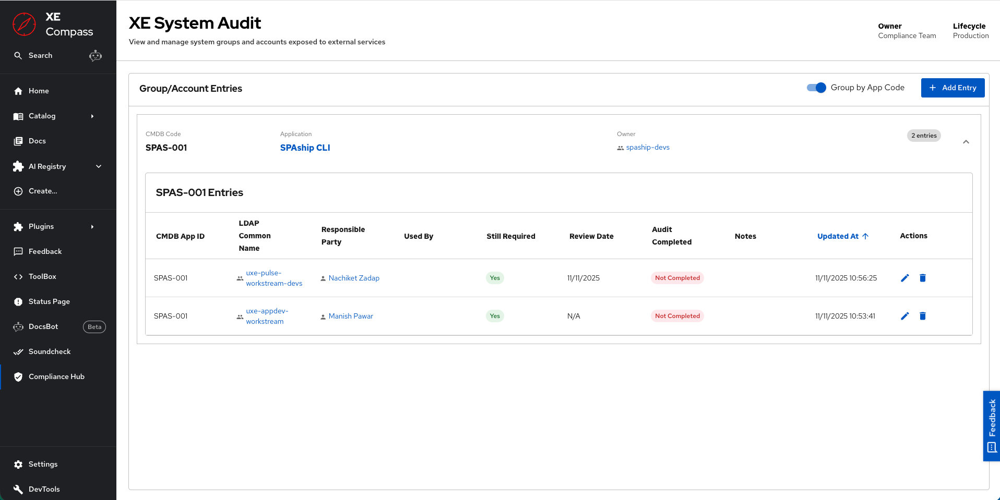
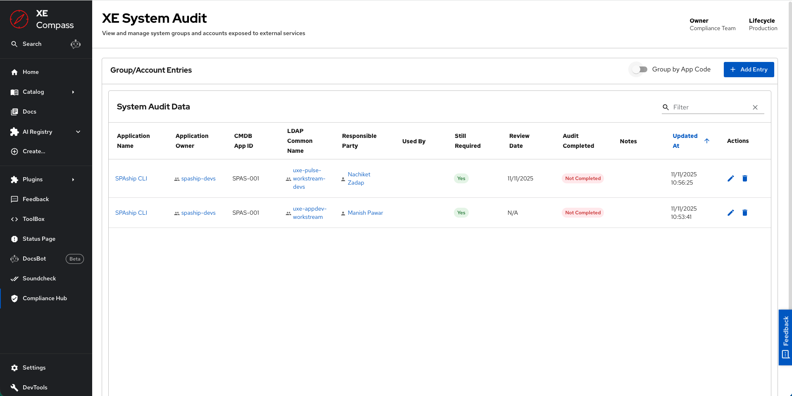
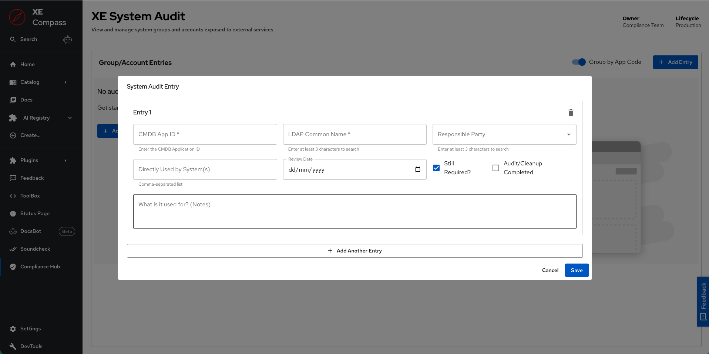
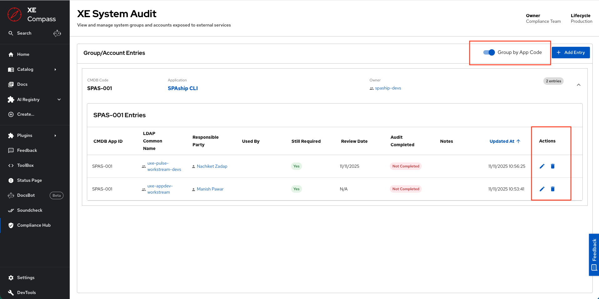
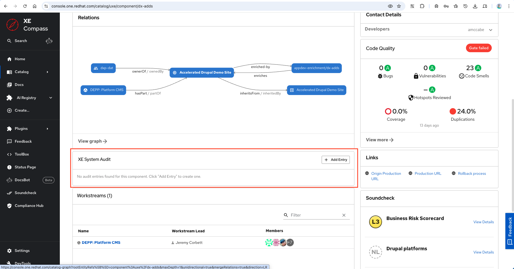
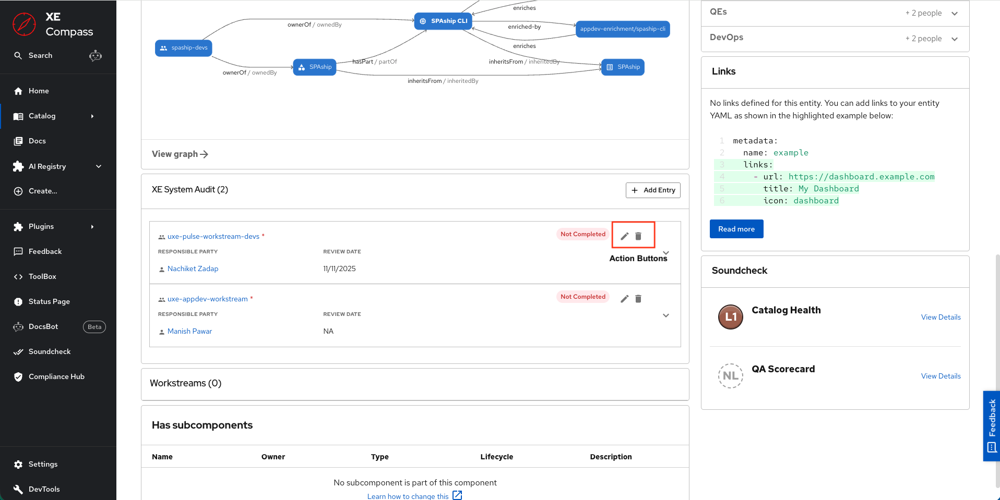

# XE System Audit Plugin — Usage Guide

This guide describes how to use the XE System Audit Plugin to track and manage system groups and accounts exposed to external services.

## Overview

The XE System Audit Plugin is a **dedicated, standalone plugin** with a complete user interface and backend service. The plugin provides two main interfaces for managing audit entries:

1. **Main Audit Page**: Comprehensive view of all audit entries with table and grouped views
2. **Entity Card**: Component-specific view showing entries for a particular Backstage entity

## Main Audit Page

**URL:** `/compliance/system-audit`

The main audit page is accessible through the Compliance Hub and provides a comprehensive interface for managing all system audit entries.

### Features

- **Table View**: Display all entries in a searchable, sortable table
- **Grouped View**: Organize entries by CMDB App ID in expandable accordions
- **Application Integration**: Automatic enrichment with application details from catalog
- **CRUD Operations**: Create, read, update, and delete entries
- **Status Indicators**: Visual chips showing "Still Required" and "Audit Completed" status

### View Modes

#### Grouped View (Default)

Entries are organized by CMDB App ID in expandable accordions:

- **Accordion Header**: Shows CMDB code, application name, owner, and entry count
- **Accordion Details**: Table showing all entries for that application
- **Application Links**: Click application name to navigate to entity page
- **Toggle**: Switch between grouped and flat view using the toggle

#### Flat View

All entries displayed in a single comprehensive table:

- **All Columns Visible**: See all entry details at once
- **Full Search**: Search across all columns
- **Complete Sorting**: Sort by any column
- **Toggle**: Switch back to grouped view using the toggle

### Table Columns

The table displays the following information:

- **Application Name**: Name of the linked application (with link to entity page)
- **Application Owner**: Owner of the application
- **CMDB App ID**: CMDB application identifier
- **LDAP Common Name**: LDAP group name (with link to group entity)
- **Responsible Party**: Person or team responsible (with link to user entity)
- **Used By**: List of entities that directly use this group
- **Still Required**: Status chip (Yes/No)
- **Review Date**: Date of last review
- **Audit Completed**: Status chip (Completed/Not Completed)
- **Notes**: Usage notes
- **Updated At**: Last update timestamp
- **Actions**: Edit and delete buttons

### Creating an Entry

1. Click the "Add Entry" button (top right)

2. Fill in the form fields:
   - **LDAP Common Name** (required): The LDAP group name
   - **CMDB App ID** (optional): Links to a Backstage catalog entity
   - **Rover Link** (optional): Link to Rover system
   - **Responsible Party** (optional): Person or team responsible
   - **Directly Used By** (optional): Comma-separated list of users/entities
   - **Still Required** (default: Yes): Whether the group is still needed
   - **Audit Cleanup Completed** (default: No): Whether cleanup is done
   - **Usage Notes** (optional): Additional notes
   - **Review Date** (optional): Date of last review
3. Click "Save" to create the entry

### Editing an Entry

1. Click the edit icon (pencil) in the Actions column
2. Modify any fields in the form
3. Click "Save" to update the entry

### Deleting an Entry

1. Click the delete icon (trash) in the Actions column
2. Confirm deletion in the dialog
3. The entry is permanently removed

### Searching and Filtering

- **Search Bar**: Use the table's built-in search to find entries
- **Sorting**: Click column headers to sort
- **Pagination**: Navigate through pages of entries

## Entity Card Component

The entity card displays audit entries specific to a Backstage component entity.

### Accessing the Entity Card

1. Navigate to any component entity page in Backstage
2. Find the "XE System Audit" card in the entity page layout
3. View entries filtered to that component's CMDB App ID

### Features

- **Filtered View**: Shows only entries matching the component's CMDB App ID
- **Entry Count**: Displays number of entries in the header
- **Accordion Display**: Each entry in an expandable accordion
- **Quick Actions**: Add, edit, and delete buttons
- **Status Indicators**: Visual chips for completion status
- **Entity Links**: Links to LDAP groups and responsible parties

### Adding an Entry from Entity Page

1. Click "Add Entry" button in the card header
2. CMDB App ID is automatically pre-filled from the entity
3. Fill in other required fields
4. Application name and owner are auto-populated from entity
5. Click "Save" to create the entry

### Viewing Entry Details

Each entry in the accordion shows:

- **Header**:
  - LDAP Common Name (with link to group entity)
  - "Still Required" indicator (red asterisk if true)
  - Completion status chip
  - Edit and delete buttons

- **Summary** (in accordion header):
  - Responsible Party (with link to user entity)
  - Used By (comma-separated list)
  - Review Date

- **Details** (in accordion body):
  - Still Required status
  - Usage Notes (if provided)

### Editing from Entity Card

1. Click the edit icon on an entry
2. Modify fields in the dialog
3. CMDB App ID is locked (cannot be changed from entity page)
4. Click "Save" to update

### Deleting from Entity Card

1. Click the delete icon on an entry
2. Confirm deletion in the dialog
3. Entry is removed

## Field Descriptions

### LDAP Common Name

- **Required**: Yes
- **Description**: The name of the LDAP group being tracked
- **Format**: Standard LDAP group name
- **Example**: `my-external-group`

### CMDB App ID

- **Required**: No
- **Description**: Links the entry to a Backstage catalog entity
- **Format**: Should match `servicenow.com/appcode` annotation on entity
- **Example**: `APP123`
- **Effect**: Enables automatic enrichment with application details

### Rover Link

- **Required**: No
- **Description**: Link to Rover system for additional information
- **Format**: Full URL
- **Example**: `https://rover.example.com/groups/my-group`

### Responsible Party

- **Required**: No
- **Description**: Person or team responsible for the group
- **Format**: Username or entity reference
- **Example**: `user:redhat/john.doe` or `john.doe`
- **Display**: Links to user entity page if valid

### Directly Used By

- **Required**: No
- **Description**: List of entities that directly use this group
- **Format**: Comma-separated list
- **Example**: `service-a, service-b, user:redhat/jane.doe`
- **Storage**: Stored as JSON array in database

### Still Required

- **Required**: No (default: Yes)
- **Description**: Whether the group is still needed
- **Type**: Boolean
- **Display**: Green chip for "Yes", red chip for "No"
- **Purpose**: Track if group can be removed

### Audit Cleanup Completed

- **Required**: No (default: No)
- **Description**: Whether audit cleanup is completed
- **Type**: Boolean
- **Display**: Green chip for "Completed", red chip for "Not Completed"
- **Purpose**: Track cleanup status

### Usage Notes

- **Required**: No
- **Description**: Additional notes about the group's usage
- **Format**: Free text
- **Purpose**: Document context, findings, or actions

### Review Date

- **Required**: No
- **Description**: Date when the last review was completed
- **Format**: Date picker
- **Purpose**: Track review cycle compliance

## Workflow Examples

### Rover Groups Audit Process

The main goal of this process is to create a complete inventory of your Rover Groups and use it to track the progress of user access audits. By documenting which groups you own and where they're used, we'll establish a solid baseline for managing user permissions.

Once the groups are documented, the final step is to audit each group's members to ensure only those who still need access retain it.

#### Important Note on Auditing

Rover automatically removes users who have left the company, so you don't need to check for them. Your focus should be on finding users who have changed roles, changed teams, or no longer need access to the resources provided by the group and removing them.

**Note:** Please don't adjust the filters on the spreadsheet. If you want to list only your groups, please go to Data -> Create filter view to make a personal filter.

#### Step 1: Go to the Rover Groups Page

Navigate to the main groups listing: https://rover.redhat.com/groups/

#### Step 2: Identify and List Your Groups

Document every group for which you are listed as an owner. For each group, create an entry in the System Audit plugin with the following information:

- **CMDB App ID** (Column A): Enter the associated application ID
- **LDAP Common Name** (Column B): Use the exact LDAP Common Name from the Rover listing
- **Rover Link** (Column C): This link will auto-generate based on the LDAP Group Name you entered, or you can manually add the Rover group URL
- **Responsible Party** (Column D): List the person who will be asked to review the users who have access (likely you)
- **Directly Used By** (Column E): Which systems or applications use this Rover group for access control?
  - Example: Bitwarden or Drupal
- **Still Required?** (Column F):
  - If the Rover group is still in use, mark as "Yes"
  - If the group is no longer used, mark as "No"
- **Audit Cleanup Completed** (Column G): Date you removed all non-required users or completed the audit
- **Usage Notes** (Column H): Provide a brief explanation of the group's purpose or any additional notes

To create entries in the plugin:
1. Navigate to `/compliance/system-audit` or use the entity card on an application's entity page
2. Click "Add Entry"
3. Fill in all the fields listed above
4. Click "Save" to create the entry

#### Step 3: Complete the Audit

Once all your groups are documented, complete the audit:

1. **Audit Group Membership**: Go through the members of each of your documented groups. For any user who no longer requires access (due to a role or team change, etc.), remove them from the group in Rover.

2. **Complete the Audit**: Once you've finished auditing and cleaning up the members for a group:
   - Update the "Audit Cleanup Completed" status to "Yes" in the plugin entry
   - Enter the completion date in the "Review Date" field for that entry
   - Optionally add notes about what was found and cleaned up in the "Usage Notes" field

### Initial Setup

1. **Identify Exposed Groups**: List all LDAP groups exposed to external services
2. **Link to Applications**: Determine which CMDB App ID each group belongs to
3. **Create Entries**: Add entries for each group
4. **Set Responsible Parties**: Assign owners for each group
5. **Document Usage**: Add notes about who uses each group and why

### Regular Review Cycle

1. **Access Main Page**: Navigate to `/compliance/system-audit`
2. **Review Entries**: Go through each entry
3. **Update Status**: Mark "Still Required" as No if group is no longer needed
4. **Complete Reviews**: Mark "Audit Cleanup Completed" when done
5. **Update Review Date**: Set current date after completing review
6. **Add Notes**: Document findings or actions taken

### Application-Specific Review

1. **Navigate to Entity**: Go to the application's entity page
2. **View Audit Card**: Check the System Audit card
3. **Review Entries**: Review all entries for that application
4. **Update as Needed**: Edit entries to reflect current status
5. **Add New Entries**: Add any newly discovered groups

### Cleanup Process

1. **Identify Unused Groups**: Find entries with "Still Required" = No
2. **Verify Cleanup**: Ensure cleanup actions are completed
3. **Mark Complete**: Set "Audit Cleanup Completed" = Yes
4. **Update Review Date**: Record when cleanup was completed
5. **Document**: Add notes about cleanup actions

## Best Practices

### Entry Management

- **Complete Information**: Fill in all relevant fields for better tracking
- **Link to Applications**: Always provide CMDB App ID when possible
- **Regular Updates**: Keep entries current with regular reviews
- **Clear Notes**: Write clear, actionable usage notes
- **Status Accuracy**: Keep status flags accurate and up to date

### Organization

- **Use Grouped View**: Group by application for better organization
- **Consistent Naming**: Use consistent LDAP group naming
- **CMDB Alignment**: Ensure CMDB App IDs match catalog annotations
- **Regular Cleanup**: Remove or update obsolete entries

### Review Process

- **Schedule Reviews**: Establish regular review cycles
- **Document Findings**: Always add notes when updating entries
- **Track Completion**: Use status flags to track progress
- **Follow Up**: Ensure cleanup actions are completed and documented

### Integration

- **Catalog Alignment**: Ensure catalog entities have proper annotations
- **Entity Cards**: Use entity cards for application-specific views
- **Links**: Leverage entity links for navigation
- **Enrichment**: Take advantage of automatic application enrichment

## Tips and Tricks

### Efficient Entry Creation

- Use entity cards when working on specific applications
- Pre-fill CMDB App ID from entity context
- Copy similar entries and modify as needed

### Finding Entries

- Use search to find entries by LDAP name or CMDB App ID
- Switch to flat view to see all details at once
- Use grouped view to focus on specific applications

### Status Management

- Use "Still Required" to identify groups that can be removed
- Use "Audit Cleanup Completed" to track cleanup progress
- Update review dates to track compliance

### Integration Benefits

- Link to applications for automatic enrichment
- Use entity cards for context-specific views
- Leverage entity links for navigation

## Troubleshooting

### Entry Not Showing

- Check CMDB App ID matches catalog annotation
- Verify entry was saved successfully
- Refresh the page
- Check browser console for errors

### Application Not Enriched

- Verify catalog entity has `servicenow.com/appcode` annotation
- Check CMDB App ID matches annotation value
- Ensure catalog API is accessible
- Verify entity exists in catalog

### Entity Card Not Appearing

- Check entity card is added to entity page layout
- Verify entity has CMDB app code annotation
- Check for JavaScript errors in console
- Ensure route is configured correctly

For more troubleshooting help, see the [FAQ](faq.md).

