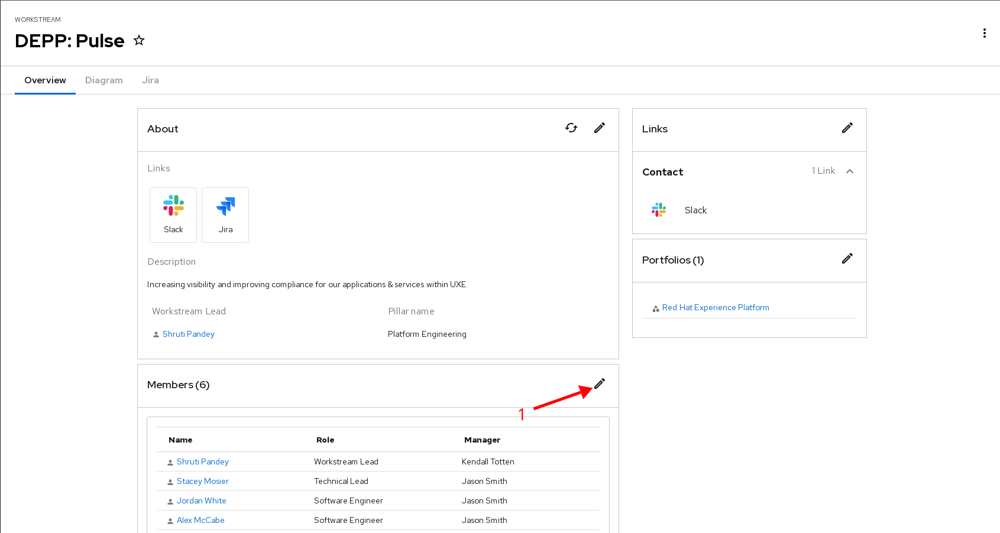
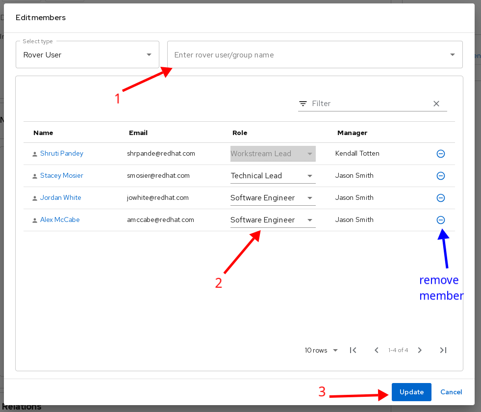

# Usage

## Adding Members

To add members to your workstream, navigate to your workstream details page, for eg. [DEPP: Pulse](https://console.one.redhat.com/catalog/redhat/workstream/depp-pulse)

1. Click on the pencil icon to open edit options.

   

2. After edit modal is opened follow this

   1. Search for user in search field.
   2. After the user is added, select role for user.
   3. Click **Update** to save the changes.
   4. Remove members from the action column.

   

  If you have any questions or queries, contact us on slack: [#forum-one-platform](https://redhat.enterprise.slack.com/archives/C04FC8AUM3M)

