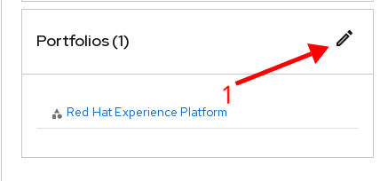
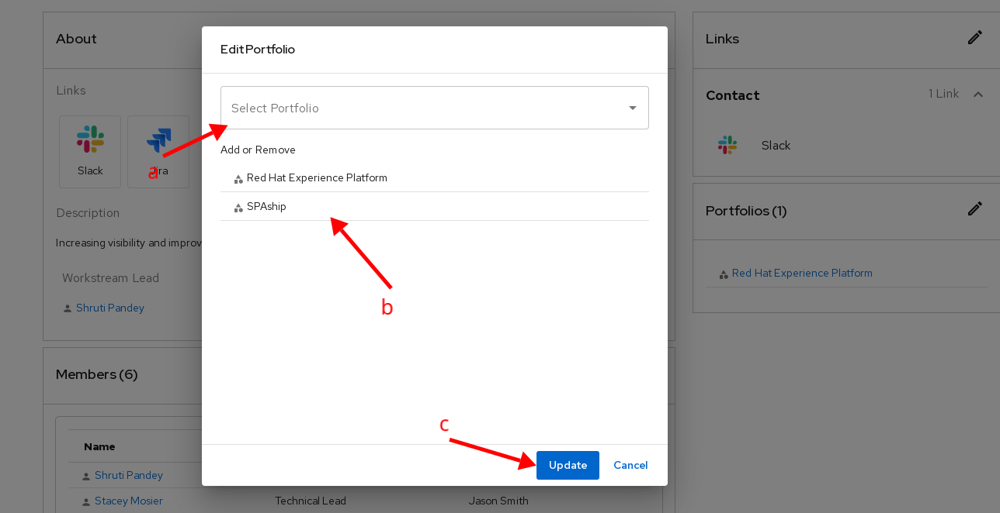

# Usage

## Adding Portfolio

To add portfolio to your workstream, navigate to your workstream details page, for eg. [DEPP: Pulse](https://console.one.redhat.com/catalog/redhat/workstream/depp-pulse)

1. Click on the edit icon on portfolio card to open edit options.

   

2. To add portfolio follow this options:

   1. Search and select your project from the dropdown
   2. Check if the project is selected and shows in list
   3. Click on **Update** button to save the changes

   

  If you have any questions or queries, contact us on slack: [#forum-one-platform](https://redhat.enterprise.slack.com/archives/C04FC8AUM3M)

