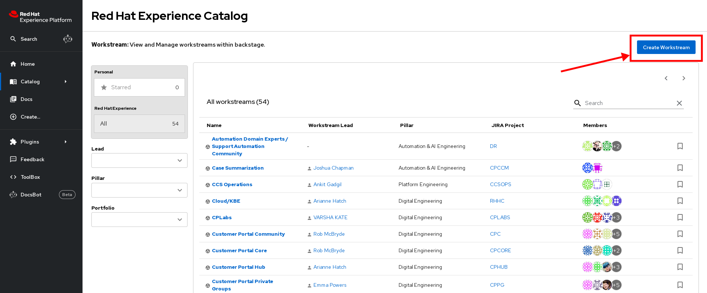
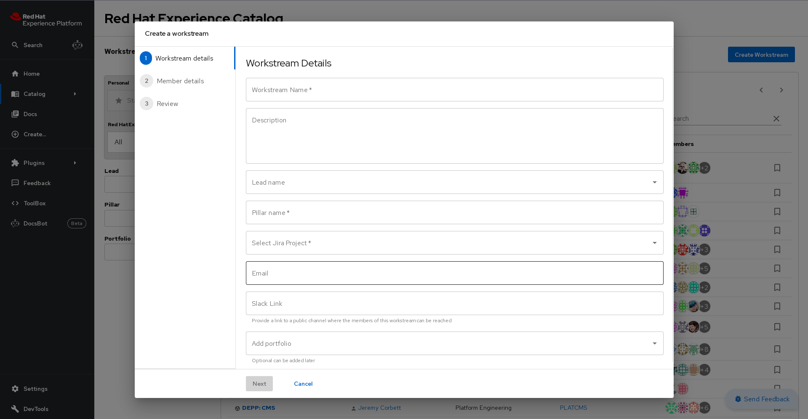
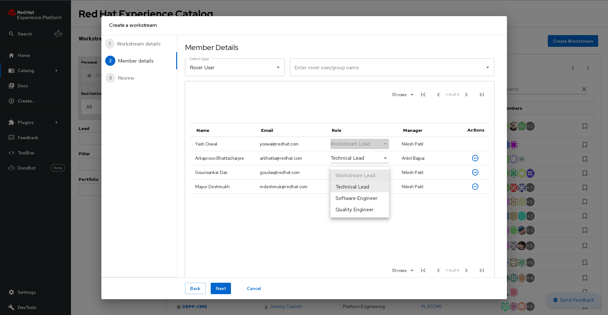

# Usage

## Create New Workstream

On the landing page you'll see the **[Create Workstream](https://console.one.redhat.com/catalog?filters%5Bkind%5D=workstream)** button on top right of the catalog.

This Button will open a form to create new workstreams, following is the description of form fields:

| Field               | Description                                                                                                                                                                 | Required |
| ------------------- | --------------------------------------------------------------------------------------------------------------------------------------------------------------------------- | -------- |
| **Workstream Name** | Name of workstream, should be unique and not match any other workstream                                                                                                     | ✅       |
| **Description**     | Brief description of your workstream.                                                                                                                                       | ❌       |
| **Lead Name**       | Search and select your workstream lead from the dropdown                                                                                                                    | ❌       |
| **Pillar Name**     | Type pillar name your workstream falls under                                                                                                                                | ✅       |
| **Jira Project**    | Select your Jira project from the dropdown                                                                                                                                  | ✅       |
| **Email**           | Add your team email                                                                                                                                                         | ❌       |
| **Slack Link**      | Add Slack channel url for your project                                                                                                                                      | ❌       |
| **Add Portfolio**   | Select Projects that belong to your Workstream  (If your project is not showing in dropdown,read the Onboarding Guide to add your projects and components in backstage) | ❌       |

Click **Next** to proceed to add members:

> This step is optional, you can add memebers later too

- You can add members directly by searching your rover group.
- After adding members, you have to select role for each member, There are three roles for workstream members:
  - Technical Lead
  - Software Engineer
  - Quality Engineer

Click **Next** to proceed to review page, Review all the fields that you have filled and click on **Create** to create new Workstream.

  If you have any questions or queries, contact us on slack: [#forum-one-platform](https://redhat.enterprise.slack.com/archives/C04FC8AUM3M)

